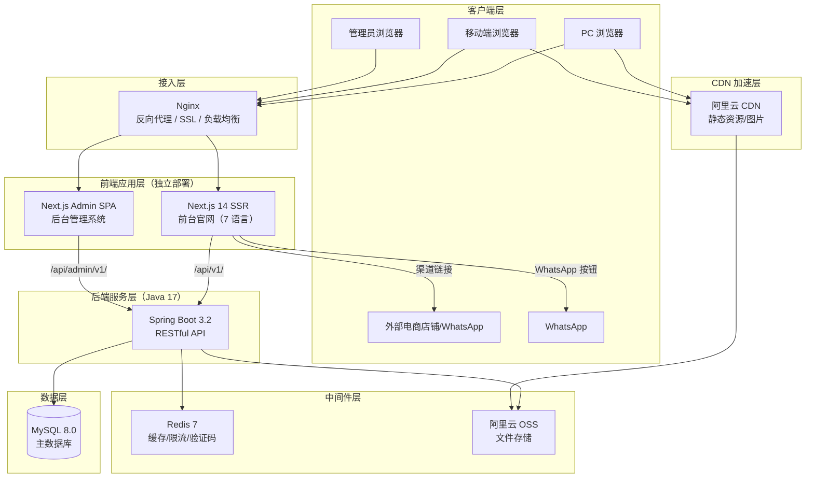
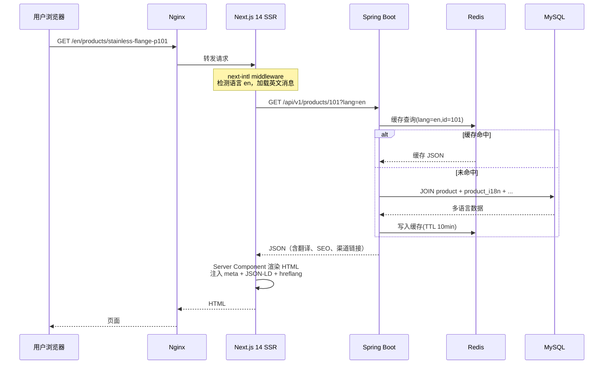
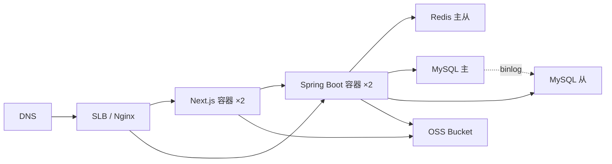
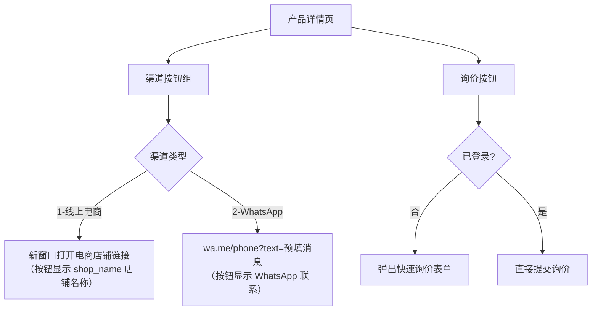
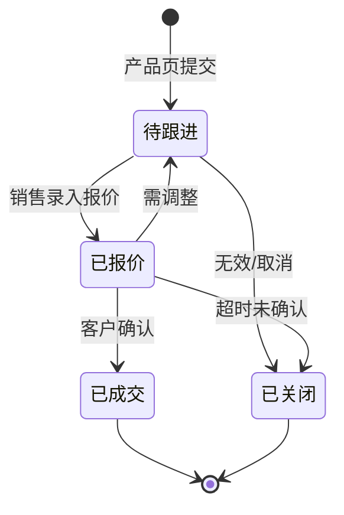
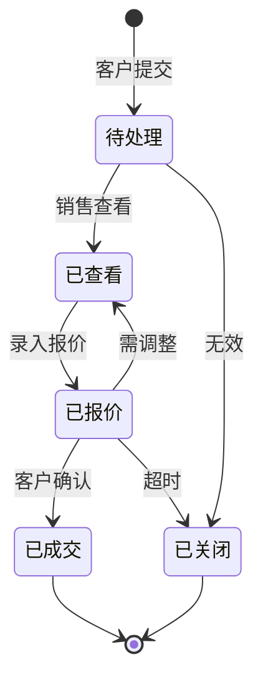
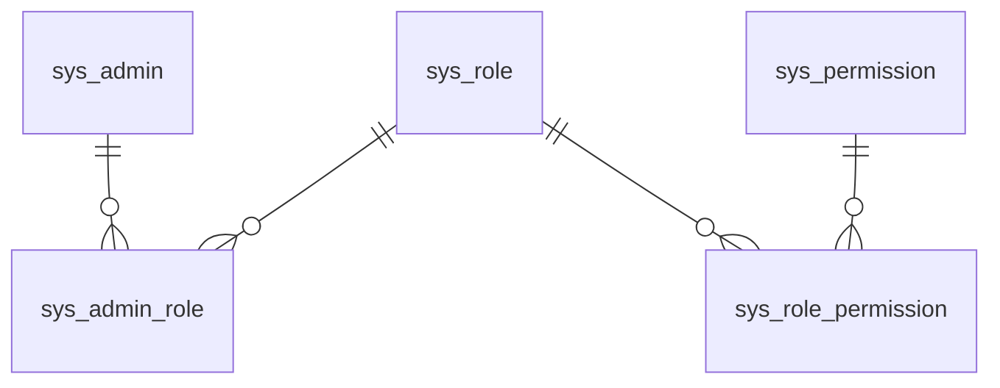

# B2B 企业官网设计文档

> **版本**：v3.0  
> **日期**：2025-07-01  
> **文档类型**：需求规格说明书 + 技术方案 + 数据库架构设计  
> **适用范围**：面向企业客户（B2B）的现货产品展示与批发定制官网

---

## 目录

- [1. 项目概述](#1-项目概述)
- [2. 需求分析](#2-需求分析)
- [3. 系统架构设计](#3-系统架构设计)
- [4. 功能模块设计](#4-功能模块设计)
- [5. 数据库设计](#5-数据库设计)
- [6. 接口设计](#6-接口设计)
- [7. 安全设计](#7-安全设计)
- [8. SEO 方案](#8-seo-方案)
- [9. 多语言方案](#9-多语言方案)
- [10. 部署方案](#10-部署方案)
- [11. 开发计划](#11-开发计划)
- [12. 风险与应对](#12-风险与应对)
- [附录 A. 完整建表 SQL](#附录-a-完整建表-sql)
- [附录 B. 术语表](#附录-b-术语表)

---

## 1. 项目概述

### 1.1 项目背景

本项目为一家同时经营**现货产品展示**与**批发定制服务**的企业构建 B2B 官方网站。核心业务模式：

- **现货产品**：仅做产品展示，**不提供站内购买**。客户通过产品页配置的外部渠道链接跳转至线上电商店铺下单，或通过 WhatsApp 按钮直接联系销售（预填产品名称与编号）。
- **批发定制**：客户在线提交定制需求（材质、尺寸、数量、工艺等），后台跟进报价，无在线支付。

### 1.2 项目目标

| 维度 | 指标 |
|------|------|
| 业务目标 | 线上询价/定制需求获取量提升 50%，外部渠道引流转化率提升 30% |
| 性能目标 | LCP < 2.5s，TTFB < 500ms，API 平均响应 < 200ms |
| SEO | 7 种语言页面全部收录；核心关键词进入首页；自然流量占比 > 40% |
| 多语言 | 一期 7 种语言（简中/繁中/英/日/韩/西/阿），阿拉伯语 RTL |
| 可用性 | ≥ 99.9%，PC + 移动端响应式 |
| SKU 规模 | 设计支持 10 万+ 产品 / 50 万+ SKU，预留水平拆分能力 |

### 1.3 项目范围

**包含：** 前台 SSR 官网、后台管理系统、7 语言全链路、SEO 全链路、产品渠道跳转、统一询价、定制需求管理。

**不包含（二期）：** 在线支付、站内购物车/下单流程、物流追踪、客户自助门户。

### 1.4 用户画像

| 角色 | 核心诉求 |
|------|---------|
| 企业采购商 | 浏览现货、查看规格库存、跳转至熟悉的平台下单或 WhatsApp 联系 |
| 定制需求客户 | 了解定制能力、提交定制需求、获取报价 |
| 批发商/经销商 | 了解价格体系、批量询价、长期合作 |
| 运营人员 | 管理产品/渠道链接/多语言内容/新闻/Banner |
| 销售人员 | 跟进询价单与定制需求、录入报价 |
| 系统管理员 | 账号权限、系统配置、操作审计 |

---

## 2. 需求分析

### 2.1 前台功能需求

| 编号 | 功能名称 | 功能描述 | 优先级 |
|------|---------|---------|--------|
| F-001 | 首页轮播 | 多语言 Banner，支持跳转链接、排序、定时上下架 | 高 |
| F-002 | 公司简介入口 | 首页摘要 + 跳转关于我们 | 高 |
| F-003 | 核心产品推荐 | 推荐/热销产品卡片，展示价格区间与购买渠道入口 | 高 |
| F-004 | 定制能力入口 | 定制服务介绍，引导至定制页面 | 高 |
| F-005 | 新闻/资质展示 | 最新新闻与资质荣誉 | 中 |
| F-006 | 合作伙伴 | 合作企业 Logo 墙 | 中 |
| F-007 | 语言切换 | 顶部语言选择器，7 种语言切换，URL 带语言前缀 | 高 |
| F-008 | 产品分类浏览 | 多级分类树，左侧导航，多语言分类名 | 高 |
| F-009 | 产品筛选 | 按分类、价格区间、规格属性筛选排序 | 高 |
| F-010 | 产品搜索 | 关键词搜索（名称/型号/描述），中文 ngram 全文索引 | 高 |
| F-011 | 产品详情页 | 多图轮播、规格参数表、价格区间、库存、渠道购买按钮、WhatsApp 联系、询价按钮 | 高 |
| F-012 | 渠道跳转购买 | 每个产品可配置多个购买渠道（线上电商店铺/WhatsApp），标注店铺名称，点击新窗口跳转 | 高 |
| F-013 | WhatsApp 联系 | 按钮跳转 wa.me 链接，预填产品名称/编号/咨询消息（按当前语言） | 高 |
| F-014 | 产品直接询价 | 产品页直接提交询价（无需加购），填写数量与备注 | 高 |
| F-015 | 定制流程说明 | 图文展示定制流程（需求→报价→打样→生产→交付） | 高 |
| F-016 | 定制案例展示 | 多语言案例展示 | 中 |
| F-017 | 在线定制表单 | 选择材质/工艺（后台配置），填写尺寸/数量/预算/附件/备注，提交 | 高 |
| F-018 | 关于我们 | 公司介绍、发展历程、资质荣誉、工厂/团队展示（多语言） | 高 |
| F-019 | 新闻列表/详情 | 多语言新闻分类、列表、富文本详情 | 中 |
| F-020 | 联系我们 | 联系方式、地图、在线留言表单 | 高 |
| F-021 | 企业客户注册 | 填写企业信息，提交后待审核 | 高 |
| F-022 | 用户登录 | 账号密码登录 + 验证码 | 高 |
| F-023 | 个人中心 | 企业信息维护、我的询价单、我的定制需求 | 中 |

### 2.2 后台功能需求

| 编号 | 功能名称 | 功能描述 | 优先级 |
|------|---------|---------|--------|
| B-001 | 仪表盘 | 今日询价数、定制需求数、产品数、客户数、趋势图 | 高 |
| B-002 | 产品分类管理 | 分类 CRUD、排序、层级，多语言分类名/描述/SEO | 高 |
| B-003 | 产品管理 | 产品/SKU 管理、规格属性、多图、库存、价格区间、上下架、多语言内容 | 高 |
| B-004 | 渠道链接管理 | 为每个产品配置购买渠道（线上电商/WhatsApp）、店铺名称、URL、排序、启用 | 高 |
| B-005 | 多语言内容管理 | 产品/分类/属性/新闻/案例/页面/公司信息的各语言翻译维护 | 高 |
| B-006 | 询价管理 | 查看产品询价，状态流转，录入报价 | 高 |
| B-007 | 定制需求管理 | 查看客户提交的定制工单，跟进状态、录入报价 | 高 |
| B-008 | 定制选项管理 | 材质/工艺等选项配置，多语言选项值 | 高 |
| B-009 | 新闻管理 | 新闻分类、发布/编辑、多语言内容、SEO | 中 |
| B-010 | Banner 管理 | 多语言 Banner 图、标题、链接、排序、定时 | 高 |
| B-011 | 案例管理 | 定制案例 CRUD、多语言内容 | 中 |
| B-012 | 页面内容管理 | 关于我们/联系我们等单页内容的多语言编辑 | 中 |
| B-013 | 公司信息管理 | 各语言版本的公司名称、标语、简介、地址等 | 中 |
| B-014 | 企业客户审核 | 审核注册企业（通过/驳回）、分组、启用/禁用 | 高 |
| B-015 | 留言管理 | 查看留言、回复、标记处理状态 | 中 |
| B-016 | 语言管理 | 启用/禁用语言、排序、RTL 标识 | 高 |
| B-017 | 管理员/角色/权限 | 管理员 CRUD、角色定义、RBAC 权限分配 | 高 |
| B-018 | 操作日志 | 管理员写操作审计 | 高 |
| B-019 | 系统设置 | SEO 全局设置、文件存储、字典 | 中 |

### 2.3 非功能需求

**性能：** LCP < 2.5s，TTFB < 500ms，API P95 < 500ms，支持 500 并发，图片 WebP + 懒加载 + CDN。

**安全：** bcrypt 密码哈希、JWT 认证、RBAC 授权、XSS/CSRF/SQL 注入防护、接口限流、文件上传白名单、操作审计、全站 HTTPS、敏感数据脱敏。

**多语言：** 7 种语言（zh-CN/zh-TW/en/ja/ko/es/ar），阿拉伯语 RTL，独立翻译表存储，URL 语言前缀。

**SEO：** 全站 SSR、每页自定义 meta、Schema.org JSON-LD、多语言 sitemap + hreflang、robots.txt、OG/Twitter Card、语义化 slug URL。

**兼容性：** Chrome 90+、Firefox 88+、Safari 14+、Edge 90+；PC/平板/手机响应式。

---

## 3. 系统架构设计

### 3.1 技术栈选型

| 层级 | 技术 | 版本 | 说明 |
|------|------|------|------|
| **前端框架** | Next.js | 14.x（App Router） | React 18 SSR/SSG/ISR，SEO 最佳实践 |
| **前端语言** | TypeScript | 5.x | 类型安全 |
| **UI 样式** | Tailwind CSS | 3.x | 原子化 CSS，RTL 逻辑属性支持 |
| **前台组件** | shadcn/ui | latest | 可复制组件，高度可定制 |
| **后台 UI** | Ant Design | 5.x | 企业级管理后台组件库 |
| **i18n** | next-intl | 3.x | Next.js App Router 官方推荐国际化方案 |
| **状态管理** | Zustand | 4.x | 轻量状态管理 |
| **表单** | React Hook Form + Zod | 7.x / 3.x | 表单校验 |
| **图表** | ECharts | 5.x | 后台仪表盘 |
| **后端框架** | Spring Boot | 3.2.x | Java 17 LTS |
| **安全** | Spring Security | 6.x | 认证授权 |
| **ORM** | MyBatis-Plus | 3.5.x | 数据访问，代码生成 |
| **API 文档** | Knife4j | 4.x | Swagger 增强 |
| **数据库** | MySQL | 8.0 | InnoDB + utf8mb4 |
| **缓存** | Redis | 7.x | 缓存/限流/验证码 |
| **搜索（一期）** | MySQL FULLTEXT | - | ngram 分词 |
| **搜索（二期）** | Elasticsearch | 8.x | 数据量大时引入 |
| **文件存储** | 阿里云 OSS / MinIO | - | 图片/附件 |
| **部署** | Docker + Nginx | - | 容器化 + 反向代理 |

**选型理由：**

1. **Next.js 14 App Router** 是目前 SSR/SSG/ISR 能力最成熟的 React 框架，对 SEO 支持极佳；Server Components 可减少客户端 JS 体积，提升首屏性能。
2. **next-intl** 专为 Next.js App Router 设计，自动处理语言路由前缀、hreflang、消息加载，配合 middleware 实现语言检测与重定向。
3. **Spring Boot 3.2 + Java 17** 是企业级项目最成熟的组合，生态完善、人才充足、长期维护有保障。
4. **MyBatis-Plus** 在国内 B2B/电商项目广泛使用，代码生成器可大幅提升开发效率。
5. **前后端独立部署**：Next.js 前台 SSR 服务与 Spring Boot API 服务分别容器化，通过 Nginx 统一路由。

### 3.2 系统架构图



### 3.3 前台 SSR 请求数据流



### 3.4 部署架构



### 3.5 产品搜索方案

| 维度 | MySQL FULLTEXT（一期） | Elasticsearch（二期） |
|------|----------------------|----------------------|
| 中文分词 | ngram parser | IK Analyzer，效果更好 |
| 部署成本 | 零 | 需独立集群 |
| 查询性能 | 50 万产品内 < 100ms | 百万级 < 50ms |
| 高级功能 | 基本匹配 | 同义词/纠错/聚合/拼音/权重 |
| 同步机制 | - | Canal 监听 binlog → ES |

一期使用 MySQL FULLTEXT + ngram，预留 Canal binlog 监听能力，数据量 > 50 万时平滑切换 ES。

### 3.6 SKU 扩展性设计

- 采用产品/SKU/属性/属性值/关联五表模型，灵活支持任意规格组合
- 高频查询使用复合索引覆盖
- **水平拆分预留**：当 SKU > 500 万时，按 spu_id 哈希分 8 表；> 5000 万时按 category_id 范围分库，引入 ShardingSphere

---

## 4. 功能模块设计

### 4.1 模块总览

| 模块 | 职责 |
|------|------|
| 首页模块 | Banner、推荐产品、定制入口、新闻、合作伙伴 |
| 产品中心模块 | 分类树、筛选搜索、产品详情、多语言、渠道链接跳转 |
| 批发定制模块 | 流程说明、案例、定制表单（多语言选项） |
| 内容展示模块 | 关于我们、新闻、联系我们、留言（多语言） |
| 用户中心模块 | 企业注册/登录/审核、个人信息、询价/定制记录 |
| 询价模块 | 产品页直接询价提交与后台管理 |
| 多语言模块 | 语言检测、URL 前缀、翻译内容管理、RTL |
| SEO 模块 | SSR meta、JSON-LD、sitemap、OG/hreflang |
| 后台-产品管理 | 分类/产品/SKU/属性/渠道链接/多语言翻译 |
| 后台-询价管理 | 询价列表、状态流转、报价 |
| 后台-定制管理 | 定制需求工单、跟进、报价 |
| 后台-内容管理 | 新闻/Banner/案例/页面/公司信息多语言 |
| 后台-系统管理 | 语言/客户/管理员/角色权限/日志/设置 |

### 4.2 核心模块详细设计

#### 4.2.1 产品展示与渠道跳转

产品详情页购买区域展示渠道按钮组：



WhatsApp 链接格式：
```
https://wa.me/8613800138000?text=Hi,%20I'm%20interested%20in%20{product_name}%20({product_code})
```
前端根据当前语言动态替换 `{product_name}` 和 `{product_code}`。

#### 4.2.2 询价流程

- 询价从产品页直接提交，无需购物车
- 询价明细记录关联的产品、SKU、数量、规格快照
- 状态流转：



#### 4.2.3 定制需求流程

客户通过定制表单提交详细需求（材质、工艺、尺寸、数量、预算、附件等），生成定制工单：



#### 4.2.4 RBAC 权限模型



---

## 5. 数据库设计

### 5.1 数据库选型

MySQL 8.0 / InnoDB / utf8mb4_unicode_ci / BIGINT 主键 / DATETIME 时间戳。

### 5.2 多语言存储方案

**采用独立翻译表**（非 JSON 字段），所有可翻译内容从主表剥离至 i18n 表：

```
product（主表，语言无关）          product_i18n（翻译表）
┌──────────────────┐          ┌──────────────────────────┐
│ id               │1        n│ id                       │
│ category_id      │──────────│ product_id (FK)          │
│ product_code     │          │ lang_code (FK→language)  │
│ slug (默认slug)   │          │ name                     │
│ price_min/max    │          │ subtitle                 │
│ main_image       │          │ description (LONGTEXT)   │
│ status/sort...   │          │ specs_data (TEXT)        │
└──────────────────┘          │ slug (语言专属URL slug)  │
                              │ seo_title/keywords/desc  │
                              └──────────────────────────┘
```

**理由：** 每语言独立索引支持按语言搜索；SEO 友好；查询高效（`WHERE product_id=? AND lang_code=?`）；后台各语言 Tab 独立编辑。

### 5.3 数据表总览（共 42 张表）

| # | 表名 | 说明 | i18n |
|---|------|------|------|
| **系统管理（7）** | | | |
| 1 | `language` | 语言表 | — |
| 2 | `sys_admin` | 管理员表 | — |
| 3 | `sys_role` | 角色表 | — |
| 4 | `sys_permission` | 权限表 | — |
| 5 | `sys_admin_role` | 管理员-角色关联 | — |
| 6 | `sys_role_permission` | 角色-权限关联 | — |
| 7 | `sys_operation_log` | 操作日志表 | — |
| **客户（1）** | | | |
| 8 | `customer` | 企业客户表 | — |
| **产品（12）** | | | |
| 9 | `product_category` | 产品分类主表 | ✓ |
| 10 | `product_category_i18n` | 分类翻译表 | — |
| 11 | `product` | 产品主表（原 SPU） | ✓ |
| 12 | `product_i18n` | 产品翻译表 | — |
| 13 | `product_sku` | 产品 SKU 表 | — |
| 14 | `product_image` | 产品图片表 | — |
| 15 | `product_attribute` | 属性名主表 | ✓ |
| 16 | `product_attribute_i18n` | 属性名翻译表 | — |
| 17 | `product_attribute_value` | 属性值主表 | ✓ |
| 18 | `product_attribute_value_i18n` | 属性值翻译表 | — |
| 19 | `product_sku_attribute` | SKU-属性值关联表 | — |
| 20 | `product_channel` | 产品渠道链接表 | — |
| **询价（2）** | | | |
| 21 | `inquiry` | 询价单表（产品页直接询价） | — |
| 22 | `inquiry_item` | 询价单明细表 | — |
| **定制（5）** | | | |
| 23 | `custom_option` | 定制选项主表 | ✓ |
| 24 | `custom_option_i18n` | 定制选项翻译表 | — |
| 25 | `custom_option_value` | 定制选项值主表 | ✓ |
| 26 | `custom_option_value_i18n` | 定制选项值翻译表 | — |
| 27 | `custom_demand` | 定制需求工单表 | — |
| **内容（10）** | | | |
| 28 | `news_category` | 新闻分类主表 | ✓ |
| 29 | `news_category_i18n` | 新闻分类翻译表 | — |
| 30 | `news` | 新闻主表 | ✓ |
| 31 | `news_i18n` | 新闻翻译表 | — |
| 32 | `banner` | Banner 主表 | ✓ |
| 33 | `banner_i18n` | Banner 翻译表 | — |
| 34 | `case_show` | 案例主表 | ✓ |
| 35 | `case_show_i18n` | 案例翻译表 | — |
| 36 | `page_content` | 页面内容主表 | ✓ |
| 37 | `page_content_i18n` | 页面内容翻译表 | — |
| **站点（5）** | | | |
| 38 | `message` | 留言表 | — |
| 39 | `partner` | 合作伙伴表 | — |
| 40 | `company_info` | 公司信息主表（单行） | ✓ |
| 41 | `company_info_i18n` | 公司信息翻译表 | — |
| 42 | `site_setting` | 站点设置表 | — |

### 5.4 ER 关系总览

```mermaid
erDiagram
    language ||--o{ product_category_i18n : ""
    language ||--o{ product_i18n : ""
    language ||--o{ product_attribute_i18n : ""
    language ||--o{ product_attribute_value_i18n : ""
    language ||--o{ news_i18n : ""
    language ||--o{ news_category_i18n : ""
    language ||--o{ banner_i18n : ""
    language ||--o{ case_show_i18n : ""
    language ||--o{ page_content_i18n : ""
    language ||--o{ company_info_i18n : ""
    language ||--o{ custom_option_i18n : ""
    language ||--o{ custom_option_value_i18n : ""

    product_category ||--o{ product_category : "parent"
    product_category ||--o{ product : ""
    product_category ||--o{ product_category_i18n : ""
    product ||--o{ product_i18n : ""
    product ||--o{ product_sku : ""
    product ||--o{ product_image : ""
    product ||--o{ product_channel : ""
    product_category ||--o{ product_attribute : ""
    product_attribute ||--o{ product_attribute_i18n : ""
    product_attribute ||--o{ product_attribute_value : ""
    product_attribute_value ||--o{ product_attribute_value_i18n : ""
    product_sku ||--o{ product_sku_attribute : ""
    product_attribute_value ||--o{ product_sku_attribute : ""

    customer ||--o{ inquiry : ""
    inquiry ||--o{ inquiry_item : ""
    product ||--o{ inquiry_item : ""
    product_sku ||--o{ inquiry_item : ""
    customer ||--o{ custom_demand : ""

    custom_option ||--o{ custom_option_i18n : ""
    custom_option ||--o{ custom_option_value : ""
    custom_option_value ||--o{ custom_option_value_i18n : ""

    news_category ||--o{ news : ""
    news_category ||--o{ news_category_i18n : ""
    news ||--o{ news_i18n : ""
    banner ||--o{ banner_i18n : ""
    case_show ||--o{ case_show_i18n : ""
    page_content ||--o{ page_content_i18n : ""
    company_info ||--o{ company_info_i18n : ""

    sys_admin ||--o{ sys_admin_role : ""
    sys_role ||--o{ sys_admin_role : ""
    sys_role ||--o{ sys_role_permission : ""
    sys_permission ||--o{ sys_role_permission : ""
```



### 5.5 核心表字段说明

#### 5.5.1 language（语言表）

| 字段 | 类型 | 非空 | 说明 |
|------|------|------|------|
| id | BIGINT | 是 | 主键 |
| code | VARCHAR(10) | 是 | 语言代码：zh-CN, zh-TW, en, ja, ko, es, ar（UNIQUE） |
| name | VARCHAR(50) | 是 | 英文名：Chinese Simplified |
| native_name | VARCHAR(50) | 是 | 本地名：简体中文 |
| flag_icon | VARCHAR(10) | 否 | 国旗 emoji |
| is_rtl | TINYINT(1) | 是 | 是否 RTL：0/1（阿拉伯语为 1） |
| sort | INT | 是 | 排序 |
| status | TINYINT | 是 | 0-禁用，1-启用 |

#### 5.5.2 product / product_i18n

**product 主表**（语言无关）：`category_id`, `product_code`, `slug`（默认语言 URL slug）, `main_image`, `price_min`, `price_max`, `unit`, `min_order_quantity`, `total_stock`, `sales_count`, `is_hot`, `is_recommended`, `is_new`, `status`, `sort`。

**product_i18n 翻译表**：`product_id`, `lang_code`, `name`, `subtitle`, `description`（LONGTEXT 富文本）, `specs_data`（TEXT，规格参数表 JSON）, `slug`（该语言专属 URL slug）, `seo_title`, `seo_keywords`, `seo_description`。

#### 5.5.3 product_channel（产品渠道链接表）

| 字段 | 类型 | 非空 | 说明 |
|------|------|------|------|
| id | BIGINT | 是 | 主键 |
| product_id | BIGINT | 是 | 产品 ID（FK→product） |
| sku_id | BIGINT | 否 | SKU ID（可选，绑定具体规格） |
| channel_type | TINYINT | 是 | 1-线上电商，2-WhatsApp |
| shop_name | VARCHAR(100) | 否 | 店铺名称（如"XX 淘宝旗舰店""XX 1688 店"，线上电商渠道用于按钮展示；WhatsApp 渠道可空） |
| url | VARCHAR(500) | 是 | 跳转链接（线上电商为店铺 URL，WhatsApp 为 wa.me 链接） |
| qr_code | VARCHAR(500) | 否 | 渠道二维码图片（可选） |
| sort | INT | 是 | 排序 |
| status | TINYINT | 是 | 0-禁用，1-启用 |

#### 5.5.4 inquiry / inquiry_item

**inquiry**：`inquiry_no`, `source`（1-产品页直接询价，2-定制询价）, `customer_id`, `company_name`, `contact_person`, `contact_phone`, `contact_email`, `item_count`, `total_amount`, `status`（0-待跟进/1-已报价/2-已成交/3-已关闭）, `remark`, `quote_remark`, `quote_file`, `quoted_by/at`, `deal_at/closed_at/close_reason`, `ip`, `lang_code`。

**inquiry_item**：`inquiry_id`, `product_id`, `sku_id`, `product_name`（快照）, `sku_name`（快照）, `product_image`（快照）, `quantity`, `spec_info`, `unit_price`, `subtotal`。

#### 5.5.5 custom_demand（定制需求工单表）

| 字段 | 类型 | 说明 |
|------|------|------|
| id | BIGINT | 主键 |
| demand_no | VARCHAR(30) | 工单号（CUS 前缀） |
| customer_id | BIGINT | 客户 ID（可空） |
| company_name | VARCHAR(200) | 企业名称 |
| contact_person / phone / email | | 联系人信息 |
| product_type | VARCHAR(200) | 产品类型 |
| material | VARCHAR(200) | 材质 |
| craft | VARCHAR(200) | 工艺 |
| size_spec | VARCHAR(300) | 尺寸规格 |
| quantity | INT | 数量 |
| budget | DECIMAL(14,2) | 预算 |
| expected_date | DATE | 期望交付日期 |
| attachment_urls | TEXT | 附件 JSON |
| description | TEXT | 详细描述 |
| status | TINYINT | 0-待处理/1-已查看/2-已报价/3-已成交/4-已关闭 |
| quote_amount / quote_remark / quote_file | | 报价信息 |
| handler_id / handled_at / quoted_at | | 跟进信息 |
| ip / lang_code | | 提交信息 |

#### 5.5.6 翻译表通用字段

所有 i18n 表均包含：`id`、主表 ID（FK）、`lang_code`（FK→language.code）、各语言内容字段、`seo_title`/`seo_keywords`/`seo_description`（如适用）。联合唯一键 `(ref_id, lang_code)`。

`company_info_i18n` 字段：`company_info_id`, `lang_code`, `company_name`, `slogan`, `introduction`（LONGTEXT）, `address`。

### 5.6 索引策略

| 策略 | 说明 |
|------|------|
| 主键 | BIGINT AUTO_INCREMENT |
| 外键索引 | 所有 FK 自动索引 |
| 唯一索引 | code、inquiry_no、demand_no、(ref_id, lang_code) 联合唯一 |
| 复合索引 | `(category_id, status, sort)`、`(lang_code, status)`、`(type, status, created_at)` |
| 全文索引 | `product_i18n(name, subtitle, description)` ngram；`news_i18n(title, summary, content)` ngram |
| 翻译表索引 | `(ref_id, lang_code)` 唯一 + `(lang_code)` 单列 |
| 渠道表索引 | `(product_id)`、`(channel_type)`、`(status)` |
| 分表预留 | product_sku / product_sku_attribute 所有查询带 product_id 作为分片键 |

---

## 6. 接口设计

### 6.1 接口规范

- HTTPS / RESTful / JSON（UTF-8）
- JWT Bearer Token（客户与管理员分离）
- 前台前缀 `/api/v1/`，后台前缀 `/api/admin/v1/`
- 语言通过 Query `?lang=en` 或 Header `Accept-Language`，默认 zh-CN
- 分页：`page`（从 1）、`size`（默认 10，最大 100）

### 6.2 核心接口列表

#### 前台公开接口

| 方法 | 路径 | 说明 |
|------|------|------|
| GET | `/api/v1/languages` | 支持的语言列表 |
| GET | `/api/v1/home` | 首页聚合数据 |
| GET | `/api/v1/categories` | 分类树（含翻译） |
| GET | `/api/v1/products` | 产品列表（筛选/搜索/分页） |
| GET | `/api/v1/products/{id}` | 产品详情（翻译/SKU/图片/渠道链接） |
| GET | `/api/v1/products/{id}/channels` | 产品渠道链接 |
| GET | `/api/v1/products/hot` | 热销产品 |
| GET | `/api/v1/products/recommended` | 推荐产品 |
| GET | `/api/v1/custom/options` | 定制选项（含翻译） |
| GET | `/api/v1/custom/cases` | 案例列表 |
| GET | `/api/v1/news` | 新闻列表 |
| GET | `/api/v1/news/{id}` | 新闻详情 |
| GET | `/api/v1/pages/{key}` | 单页内容 |
| GET | `/api/v1/company` | 公司信息（按语言） |
| POST | `/api/v1/inquiries` | 提交产品询价 |
| POST | `/api/v1/custom/demands` | 提交定制需求 |
| POST | `/api/v1/messages` | 提交留言 |
| POST | `/api/v1/auth/register` | 企业注册 |
| POST | `/api/v1/auth/login` | 客户登录 |

#### 前台需登录接口

| 方法 | 路径 | 说明 |
|------|------|------|
| GET/PUT | `/api/v1/customer/profile` | 客户信息 |
| GET | `/api/v1/inquiries` | 我的询价单 |
| GET | `/api/v1/custom/demands` | 我的定制需求 |

#### 后台核心接口

| 方法 | 路径 | 说明 |
|------|------|------|
| POST | `/api/admin/v1/auth/login` | 管理员登录 |
| GET | `/api/admin/v1/dashboard` | 仪表盘 |
| CRUD | `/api/admin/v1/categories` | 分类管理（含 i18n） |
| CRUD | `/api/admin/v1/products` | 产品管理（含 i18n） |
| CRUD | `/api/admin/v1/skus` | SKU 管理 |
| CRUD | `/api/admin/v1/attributes` | 属性管理（含 i18n） |
| CRUD | `/api/admin/v1/channels` | 渠道链接管理 |
| GET/PUT | `/api/admin/v1/inquiries` | 询价管理/报价 |
| GET/PUT | `/api/admin/v1/custom-demands` | 定制需求管理/报价 |
| CRUD | `/api/admin/v1/news` | 新闻（含 i18n） |
| CRUD | `/api/admin/v1/banners` | Banner（含 i18n） |
| CRUD | `/api/admin/v1/cases` | 案例（含 i18n） |
| CRUD | `/api/admin/v1/pages` | 页面内容（含 i18n） |
| GET/PUT | `/api/admin/v1/company` | 公司信息（含 i18n） |
| CRUD | `/api/admin/v1/languages` | 语言管理 |
| PUT | `/api/admin/v1/customers/{id}/audit` | 客户审核 |
| CRUD | `/api/admin/v1/admins` | 管理员管理 |
| CRUD | `/api/admin/v1/roles` | 角色权限 |
| GET | `/api/admin/v1/logs` | 操作日志 |
| POST | `/api/admin/v1/upload` | 文件上传 |

### 6.3 核心接口示例

#### 提交产品询价

```
POST /api/v1/inquiries?lang=en
```
```json
{
  "source": 1,
  "companyName": "ABC Trading Ltd",
  "contactPerson": "John Smith",
  "contactPhone": "+1-555-0100",
  "contactEmail": "john@abc.com",
  "items": [
    { "productId": 101, "skuId": 1001, "quantity": 500, "specInfo": "304 Stainless, 200mm" }
  ],
  "remark": "Please quote FOB price"
}
```
```json
{
  "code": 200,
  "message": "success",
  "data": { "id": 301, "inquiryNo": "INQ202507010001", "status": 0 }
}
```

#### 提交定制需求

```
POST /api/v1/custom/demands?lang=ar
```
```json
{
  "companyName": "شركة المستقبل",
  "contactPerson": "محمد",
  "contactPhone": "+966-500-000-000",
  "productType": "إطارات معدنية",
  "material": "ستانلس ستيل 304",
  "craft": "قطع بالليزر، ثني، لحام",
  "sizeSpec": "200×150×3mm",
  "quantity": 10000,
  "budget": 50000,
  "expectedDate": "2025-10-01",
  "attachmentUrls": ["https://oss.example.com/design.pdf"],
  "description": "تشطيب مصقول، تفاوت ±0.1mm"
}
```

---

## 7. 安全设计

| 维度 | 措施 |
|------|------|
| 认证 | JWT（Access 2h + Refresh 7d/1d），bcrypt cost=12，前端 RSA 加密传输 |
| 授权 | RBAC 菜单+按钮+接口三级权限；客户仅操作自己的数据 |
| 登录防护 | 验证码 + 5 次失败锁定（客户 15min / 管理员 30min） |
| XSS | React 默认转义 + jsoup 富文本白名单 + CSP 头 |
| CSRF | SameSite Cookie + Token 双重验证 |
| SQL 注入 | MyBatis-Plus 参数化查询，排序字段白名单 |
| 文件上传 | 类型白名单（jpg/png/pdf/doc/xls），10MB 限制，随机重命名，OSS 隔离 |
| 限流 | Redis 滑动窗口：登录 5/min、注册 3/min、询价 10/min |
| 审计 | sys_operation_log 记录所有管理员写操作，保留 1 年 |
| 传输 | 全站 HTTPS（TLS 1.2+），HSTS |
| 响应头 | X-Content-Type-Options、X-Frame-Options、CSP、Referrer-Policy |

---

## 8. SEO 方案

### 8.1 SSR 渲染

- Next.js 14 App Router 默认 Server Components，服务端返回完整 HTML
- 产品页/分类页/新闻页启用 ISR（`revalidate: 600`），缓存 10 分钟
- 使用 `generateMetadata` 动态设置每页 title/description/keywords（从 i18n 表读取）

### 8.2 结构化数据（JSON-LD）

产品页输出 Product、BreadcrumbList、Organization；新闻页输出 Article；分类页输出 BreadcrumbList + ItemList。

```json
{
  "@context": "https://schema.org/",
  "@type": "Product",
  "name": "{{name}}",
  "image": ["{{mainImage}}"],
  "description": "{{subtitle}}",
  "sku": "{{productCode}}",
  "brand": { "@type": "Brand", "name": "{{companyName}}" },
  "offers": {
    "@type": "AggregateOffer",
    "lowPrice": "{{priceMin}}",
    "highPrice": "{{priceMax}}",
    "priceCurrency": "USD"
  }
}
```

### 8.3 多语言 SEO

- URL：`/en/products/stainless-flange-p101`、`/ar/products/شفة-ستانلس-p101`
- hreflang 标签自动生成：
```html
<link rel="alternate" hreflang="zh-CN" href="https://example.com/zh-CN/products/..." />
<link rel="alternate" hreflang="en" href="https://example.com/en/products/..." />
<link rel="alternate" hreflang="ar" href="https://example.com/ar/products/..." />
<link rel="alternate" hreflang="x-default" href="https://example.com/zh-CN/products/..." />
```
- 各语言独立 slug（存在 i18n 表 slug 字段）
- 各语言独立 SEO 字段

### 8.4 sitemap 与 robots

- 按语言生成：`/sitemap-zh-CN.xml`、`/sitemap-en.xml` 等，sitemap index 聚合
- 产品 URL 包含语义化 slug + ID
- `robots.txt` 允许抓取，禁止 `/admin/`、`/api/`

### 8.5 Open Graph / Twitter Card

每个页面动态生成 og:title、og:description、og:image、og:url、og:locale，以及 twitter:card。

---

## 9. 多语言方案

### 9.1 支持语言

| code | 语言 | native_name | RTL |
|------|------|-------------|-----|
| zh-CN | 简体中文 | 简体中文 | 否 |
| zh-TW | 繁體中文 | 繁體中文 | 否 |
| en | English | English | 否 |
| ja | 日本語 | 日本語 | 否 |
| ko | 한국어 | 한국어 | 否 |
| es | Español | Español | 否 |
| ar | العربية | العربية | **是** |

### 9.2 前端 i18n

- **next-intl** 配合 Next.js App Router middleware 实现：
  - URL 自动语言前缀（`/zh-CN/...`、`/en/...`、`/ar/...`）
  - Accept-Language 自动检测与重定向
  - hreflang 标签自动生成
- UI 文案使用 next-intl messages（JSON 文件按语言组织）
- 动态内容（产品名、描述等）从 API 按 `lang` 参数获取对应翻译

### 9.3 RTL 适配

- 阿拉伯语时 `<html dir="rtl" lang="ar">`
- Tailwind CSS 使用逻辑属性（`ms-`/`me-`/`ps-`/`pe-`）替代物理方向（`ml-`/`mr-`/`pl-`/`pr-`）
- 后台编辑阿语内容时提供 RTL 预览
- 图标/箭头方向镜像处理

### 9.4 回退策略

1. 请求语言未启用 → 重定向至默认语言（zh-CN）
2. 内容无该语言翻译 → 回退显示默认语言，页面提示"暂无此语言翻译"
3. 浏览器 Accept-Language 自动检测首选语言

---

## 10. 部署方案

### 10.1 生产环境

| 资源 | 规格 | 数量 | 用途 |
|------|------|------|------|
| ECS | 4C8G / 100GB SSD | 2 | Next.js + Spring Boot |
| RDS MySQL | 2C4G 高可用 | 1 | 主数据库 |
| Redis | 1G 主从 | 1 | 缓存 |
| OSS | 标准存储 | 1 | 文件 |
| CDN | 按流量 | 1 | 静态加速 |
| SLB | 共享型 | 1 | 负载均衡 |

### 10.2 容器化

| 镜像 | 基础镜像 |
|------|---------|
| b2b-frontend | `node:20-alpine`（构建 + 运行 Next.js standalone） |
| b2b-admin | `node:20-alpine` 构建 → `nginx:alpine` 托管静态导出 |
| b2b-backend | `eclipse-temurin:17-jre-alpine` |

### 10.3 Nginx 路由

```
example.com/        → Next.js SSR（前台）
example.com/admin/  → Next.js Admin（静态 SPA）
example.com/api/    → Spring Boot
```

### 10.4 CI/CD


### 10.5 运维

Prometheus + Grafana 监控；钉钉/企业微信告警；MySQL 每日全量 + binlog 增量备份 30 天；Docker 镜像版本化一键回滚。

---

## 11. 开发计划

| 阶段 | 工期 | 交付物 |
|------|------|--------|
| 需求 + UI 设计 | 3 周 | 需求文档、原型、UI 设计稿（含 RTL） |
| 架构 + 数据库 | 1 周 | 设计文档、建表 SQL、接口文档 |
| 环境搭建 | 1 周 | CI/CD、Docker、项目骨架 |
| 后端开发 | 7 周 | 全部 API（含多语言查询） |
| 前台开发 | 8 周 | Next.js SSR 多语言官网 |
| 后台开发 | 6 周 | 管理后台（可并行） |
| 联调测试 | 2 周 | 功能/性能/兼容性/安全测试 |
| SEO 优化 | 1 周 | 结构化数据、sitemap、性能调优 |
| 上线 | 3 天 | 生产部署 |

**总工期：约 22 周（5.5 个月）**

---

## 12. 风险与应对

| 风险 | 影响 | 概率 | 应对 |
|------|------|------|------|
| 7 语言翻译质量 | SEO 与用户体验 | 中 | 先上线 zh-CN + en，其余分批补充；回退策略 |
| 阿拉伯语 RTL | 布局错乱 | 中 | Tailwind 逻辑属性；早期真实阿语环境测试 |
| SKU 规格查询慢 | 产品页性能 | 中 | 复合索引覆盖；量大时 ES/分表 |
| SSR 渲染瓶颈 | TTFB 高 | 中 | ISR 静态化 + Redis 缓存 API + CDN |
| 外部渠道链接失效 | 客户无法跳转 | 低 | 后台定期检查链接；WhatsApp 备选 |
| 多语言 slug 重复 | URL 冲突 | 低 | 同语言下 slug 唯一索引；自动追加 ID |

---

## 附录 A. 完整建表 SQL

> 兼容 MySQL 8.0+，InnoDB，utf8mb4。共 42 张表，可直接按顺序执行。

```sql
-- ============================================================
-- B2B 企业官网建表脚本 v3.0
-- MySQL 8.0+ / InnoDB / utf8mb4
-- 42 张表（含语言表、多语言翻译表、渠道链接表、询价/定制表）
-- ============================================================

CREATE DATABASE IF NOT EXISTS `b2b_website`
  DEFAULT CHARACTER SET utf8mb4 COLLATE utf8mb4_unicode_ci;
USE `b2b_website`;
SET NAMES utf8mb4;
SET FOREIGN_KEY_CHECKS = 0;

-- ============================================================
-- 一、系统管理（7 表）
-- ============================================================

-- 1. 语言表
DROP TABLE IF EXISTS `language`;
CREATE TABLE `language` (
  `id`          BIGINT      NOT NULL AUTO_INCREMENT COMMENT '主键ID',
  `code`        VARCHAR(10) NOT NULL                COMMENT '语言代码:zh-CN,zh-TW,en,ja,ko,es,ar',
  `name`        VARCHAR(50) NOT NULL                COMMENT '语言英文名,如Chinese/English',
  `native_name` VARCHAR(50) NOT NULL                COMMENT '语言本地名称,如简体中文/English',
  `flag_icon`   VARCHAR(10) DEFAULT NULL            COMMENT '国旗emoji图标',
  `is_rtl`      TINYINT(1)  NOT NULL DEFAULT 0      COMMENT '是否RTL从右到左布局:0-否,1-是(阿拉伯语)',
  `sort`        INT         NOT NULL DEFAULT 0      COMMENT '排序序号,数值越小越靠前',
  `status`      TINYINT     NOT NULL DEFAULT 1      COMMENT '状态:0-禁用,1-启用',
  `created_at`  DATETIME    NOT NULL DEFAULT CURRENT_TIMESTAMP COMMENT '创建时间',
  `updated_at`  DATETIME    NOT NULL DEFAULT CURRENT_TIMESTAMP ON UPDATE CURRENT_TIMESTAMP COMMENT '更新时间',
  PRIMARY KEY (`id`),
  UNIQUE KEY `uk_code` (`code`)
) ENGINE=InnoDB DEFAULT CHARSET=utf8mb4 COLLATE=utf8mb4_unicode_ci COMMENT='语言表';

-- 2. 管理员表
DROP TABLE IF EXISTS `sys_admin`;
CREATE TABLE `sys_admin` (
  `id`            BIGINT       NOT NULL AUTO_INCREMENT COMMENT '主键ID',
  `username`      VARCHAR(50)  NOT NULL                COMMENT '登录用户名',
  `password`      VARCHAR(100) NOT NULL                COMMENT '密码bcrypt哈希值',
  `real_name`     VARCHAR(50)  NOT NULL                COMMENT '真实姓名',
  `email`         VARCHAR(100) DEFAULT NULL            COMMENT '邮箱地址',
  `phone`         VARCHAR(20)  DEFAULT NULL            COMMENT '手机号码',
  `avatar`        VARCHAR(500) DEFAULT NULL            COMMENT '头像图片URL',
  `status`        TINYINT      NOT NULL DEFAULT 1      COMMENT '状态:0-禁用,1-启用',
  `last_login_at` DATETIME     DEFAULT NULL            COMMENT '最后登录时间',
  `last_login_ip` VARCHAR(50)  DEFAULT NULL            COMMENT '最后登录IP地址',
  `created_at`    DATETIME     NOT NULL DEFAULT CURRENT_TIMESTAMP COMMENT '创建时间',
  `updated_at`    DATETIME     NOT NULL DEFAULT CURRENT_TIMESTAMP ON UPDATE CURRENT_TIMESTAMP COMMENT '更新时间',
  `deleted`       TINYINT(1)   NOT NULL DEFAULT 0      COMMENT '逻辑删除标记:0-未删除,1-已删除',
  PRIMARY KEY (`id`),
  UNIQUE KEY `uk_username` (`username`),
  KEY `idx_status` (`status`)
) ENGINE=InnoDB DEFAULT CHARSET=utf8mb4 COLLATE=utf8mb4_unicode_ci COMMENT='管理员表';

-- 3. 角色表
DROP TABLE IF EXISTS `sys_role`;
CREATE TABLE `sys_role` (
  `id`          BIGINT       NOT NULL AUTO_INCREMENT COMMENT '主键ID',
  `role_name`   VARCHAR(50)  NOT NULL                COMMENT '角色名称,如超级管理员/运营人员',
  `role_code`   VARCHAR(50)  NOT NULL                COMMENT '角色编码,如super_admin/operator',
  `description` VARCHAR(200) DEFAULT NULL            COMMENT '角色描述说明',
  `sort`        INT          NOT NULL DEFAULT 0      COMMENT '排序序号,数值越小越靠前',
  `status`      TINYINT      NOT NULL DEFAULT 1      COMMENT '状态:0-禁用,1-启用',
  `created_at`  DATETIME     NOT NULL DEFAULT CURRENT_TIMESTAMP COMMENT '创建时间',
  `updated_at`  DATETIME     NOT NULL DEFAULT CURRENT_TIMESTAMP ON UPDATE CURRENT_TIMESTAMP COMMENT '更新时间',
  `deleted`     TINYINT(1)   NOT NULL DEFAULT 0      COMMENT '逻辑删除标记:0-未删除,1-已删除',
  PRIMARY KEY (`id`),
  UNIQUE KEY `uk_role_code` (`role_code`)
) ENGINE=InnoDB DEFAULT CHARSET=utf8mb4 COLLATE=utf8mb4_unicode_ci COMMENT='角色表';

-- 4. 权限表
DROP TABLE IF EXISTS `sys_permission`;
CREATE TABLE `sys_permission` (
  `id`              BIGINT       NOT NULL AUTO_INCREMENT COMMENT '主键ID',
  `parent_id`       BIGINT       NOT NULL DEFAULT 0      COMMENT '父级权限ID,0表示顶级',
  `permission_name` VARCHAR(50)  NOT NULL                COMMENT '权限名称,如产品管理/用户列表',
  `permission_code` VARCHAR(100) NOT NULL                COMMENT '权限标识编码,如product:list',
  `type`            TINYINT      NOT NULL DEFAULT 1      COMMENT '权限类型:1-菜单,2-按钮,3-接口',
  `path`            VARCHAR(200) DEFAULT NULL            COMMENT '前端路由路径',
  `component`       VARCHAR(200) DEFAULT NULL            COMMENT '前端组件路径',
  `icon`            VARCHAR(50)  DEFAULT NULL            COMMENT '菜单图标名称',
  `sort`            INT          NOT NULL DEFAULT 0      COMMENT '排序序号,数值越小越靠前',
  `status`          TINYINT      NOT NULL DEFAULT 1      COMMENT '状态:0-禁用,1-启用',
  `created_at`      DATETIME     NOT NULL DEFAULT CURRENT_TIMESTAMP COMMENT '创建时间',
  `updated_at`      DATETIME     NOT NULL DEFAULT CURRENT_TIMESTAMP ON UPDATE CURRENT_TIMESTAMP COMMENT '更新时间',
  PRIMARY KEY (`id`),
  UNIQUE KEY `uk_permission_code` (`permission_code`),
  KEY `idx_parent_id` (`parent_id`)
) ENGINE=InnoDB DEFAULT CHARSET=utf8mb4 COLLATE=utf8mb4_unicode_ci COMMENT='权限表';

-- 5. 管理员-角色关联表
DROP TABLE IF EXISTS `sys_admin_role`;
CREATE TABLE `sys_admin_role` (
  `id`         BIGINT   NOT NULL AUTO_INCREMENT COMMENT '主键ID',
  `admin_id`   BIGINT   NOT NULL                COMMENT '管理员ID,关联sys_admin表',
  `role_id`    BIGINT   NOT NULL                COMMENT '角色ID,关联sys_role表',
  `created_at` DATETIME NOT NULL DEFAULT CURRENT_TIMESTAMP COMMENT '创建时间',
  PRIMARY KEY (`id`),
  UNIQUE KEY `uk_admin_role` (`admin_id`, `role_id`),
  KEY `idx_role_id` (`role_id`),
  CONSTRAINT `fk_ar_admin` FOREIGN KEY (`admin_id`) REFERENCES `sys_admin` (`id`) ON DELETE CASCADE,
  CONSTRAINT `fk_ar_role`  FOREIGN KEY (`role_id`)  REFERENCES `sys_role`  (`id`) ON DELETE CASCADE
) ENGINE=InnoDB DEFAULT CHARSET=utf8mb4 COLLATE=utf8mb4_unicode_ci COMMENT='管理员-角色关联表';

-- 6. 角色-权限关联表
DROP TABLE IF EXISTS `sys_role_permission`;
CREATE TABLE `sys_role_permission` (
  `id`            BIGINT   NOT NULL AUTO_INCREMENT COMMENT '主键ID',
  `role_id`       BIGINT   NOT NULL                COMMENT '角色ID,关联sys_role表',
  `permission_id` BIGINT   NOT NULL                COMMENT '权限ID,关联sys_permission表',
  `created_at`    DATETIME NOT NULL DEFAULT CURRENT_TIMESTAMP COMMENT '创建时间',
  PRIMARY KEY (`id`),
  UNIQUE KEY `uk_role_perm` (`role_id`, `permission_id`),
  KEY `idx_permission_id` (`permission_id`),
  CONSTRAINT `fk_rp_role` FOREIGN KEY (`role_id`)       REFERENCES `sys_role`       (`id`) ON DELETE CASCADE,
  CONSTRAINT `fk_rp_perm` FOREIGN KEY (`permission_id`) REFERENCES `sys_permission` (`id`) ON DELETE CASCADE
) ENGINE=InnoDB DEFAULT CHARSET=utf8mb4 COLLATE=utf8mb4_unicode_ci COMMENT='角色-权限关联表';

-- 7. 操作日志表
DROP TABLE IF EXISTS `sys_operation_log`;
CREATE TABLE `sys_operation_log` (
  `id`              BIGINT        NOT NULL AUTO_INCREMENT COMMENT '主键ID',
  `admin_id`        BIGINT        DEFAULT NULL            COMMENT '操作管理员ID,关联sys_admin表',
  `admin_name`      VARCHAR(50)   DEFAULT NULL            COMMENT '操作管理员用户名快照',
  `module`          VARCHAR(50)   NOT NULL                COMMENT '操作模块,如product/inquiry/customer',
  `operation`       VARCHAR(100)  NOT NULL                COMMENT '操作描述,如新增产品/删除分类',
  `method`          VARCHAR(10)   DEFAULT NULL            COMMENT 'HTTP请求方法:GET/POST/PUT/DELETE',
  `request_url`     VARCHAR(500)  DEFAULT NULL            COMMENT '请求URL路径',
  `request_params`  TEXT          DEFAULT NULL            COMMENT '请求参数JSON字符串',
  `response_result` TEXT          DEFAULT NULL            COMMENT '响应结果JSON字符串',
  `ip`              VARCHAR(50)   DEFAULT NULL            COMMENT '操作人IP地址',
  `status`          TINYINT       NOT NULL DEFAULT 1      COMMENT '操作状态:0-失败,1-成功',
  `error_msg`       VARCHAR(1000) DEFAULT NULL            COMMENT '失败时的错误信息',
  `cost_time`       BIGINT        DEFAULT NULL            COMMENT '请求耗时,单位毫秒',
  `created_at`      DATETIME      NOT NULL DEFAULT CURRENT_TIMESTAMP COMMENT '创建时间',
  PRIMARY KEY (`id`),
  KEY `idx_admin_id`   (`admin_id`),
  KEY `idx_module`     (`module`),
  KEY `idx_created_at` (`created_at`)
) ENGINE=InnoDB DEFAULT CHARSET=utf8mb4 COLLATE=utf8mb4_unicode_ci COMMENT='操作日志表';

-- ============================================================
-- 二、客户（1 表）
-- ============================================================

DROP TABLE IF EXISTS `customer`;
CREATE TABLE `customer` (
  `id`               BIGINT       NOT NULL AUTO_INCREMENT COMMENT '主键ID',
  `username`         VARCHAR(50)  NOT NULL                COMMENT '登录账号(邮箱或手机号)',
  `password`         VARCHAR(100) NOT NULL                COMMENT '密码bcrypt哈希值',
  `company_name`     VARCHAR(200) NOT NULL                COMMENT '企业/公司名称',
  `credit_code`      VARCHAR(30)  DEFAULT NULL            COMMENT '统一社会信用代码',
  `contact_person`   VARCHAR(50)  NOT NULL                COMMENT '联系人姓名',
  `contact_phone`    VARCHAR(20)  NOT NULL                COMMENT '联系电话',
  `contact_email`    VARCHAR(100) DEFAULT NULL            COMMENT '联系邮箱',
  `province`         VARCHAR(50)  DEFAULT NULL            COMMENT '省份',
  `city`             VARCHAR(50)  DEFAULT NULL            COMMENT '城市',
  `address`          VARCHAR(300) DEFAULT NULL            COMMENT '详细地址',
  `industry`         VARCHAR(100) DEFAULT NULL            COMMENT '所属行业',
  `business_license` VARCHAR(500) DEFAULT NULL            COMMENT '营业执照图片URL',
  `audit_status`     TINYINT      NOT NULL DEFAULT 0      COMMENT '审核状态:0-待审核,1-审核通过,2-审核驳回',
  `audit_remark`     VARCHAR(500) DEFAULT NULL            COMMENT '审核备注/驳回原因',
  `audited_at`       DATETIME     DEFAULT NULL            COMMENT '审核时间',
  `audited_by`       BIGINT       DEFAULT NULL            COMMENT '审核人管理员ID,关联sys_admin表',
  `status`           TINYINT      NOT NULL DEFAULT 1      COMMENT '账号状态:0-禁用,1-启用',
  `last_login_at`    DATETIME     DEFAULT NULL            COMMENT '最后登录时间',
  `last_login_ip`    VARCHAR(50)  DEFAULT NULL            COMMENT '最后登录IP地址',
  `remark`           VARCHAR(500) DEFAULT NULL            COMMENT '客户备注',
  `created_at`       DATETIME     NOT NULL DEFAULT CURRENT_TIMESTAMP COMMENT '创建时间',
  `updated_at`       DATETIME     NOT NULL DEFAULT CURRENT_TIMESTAMP ON UPDATE CURRENT_TIMESTAMP COMMENT '更新时间',
  `deleted`          TINYINT(1)   NOT NULL DEFAULT 0      COMMENT '逻辑删除标记:0-未删除,1-已删除',
  PRIMARY KEY (`id`),
  UNIQUE KEY `uk_username`   (`username`),
  KEY `idx_company_name`     (`company_name`),
  KEY `idx_credit_code`      (`credit_code`),
  KEY `idx_audit_status`     (`audit_status`),
  KEY `idx_contact_phone`    (`contact_phone`),
  KEY `idx_created_at`       (`created_at`)
) ENGINE=InnoDB DEFAULT CHARSET=utf8mb4 COLLATE=utf8mb4_unicode_ci COMMENT='企业客户表';

-- ============================================================
-- 三、产品（12 表）
-- ============================================================

-- 9. 产品分类主表
DROP TABLE IF EXISTS `product_category`;
CREATE TABLE `product_category` (
  `id`             BIGINT       NOT NULL AUTO_INCREMENT COMMENT '主键ID',
  `parent_id`      BIGINT       NOT NULL DEFAULT 0      COMMENT '父分类ID,0表示顶级分类',
  `category_image` VARCHAR(500) DEFAULT NULL            COMMENT '分类封面图片URL',
  `level`          TINYINT      NOT NULL DEFAULT 1      COMMENT '分类层级:1-一级,2-二级,3-三级',
  `sort`           INT          NOT NULL DEFAULT 0      COMMENT '排序序号,数值越小越靠前',
  `status`         TINYINT      NOT NULL DEFAULT 1      COMMENT '状态:0-禁用,1-启用',
  `created_at`     DATETIME     NOT NULL DEFAULT CURRENT_TIMESTAMP COMMENT '创建时间',
  `updated_at`     DATETIME     NOT NULL DEFAULT CURRENT_TIMESTAMP ON UPDATE CURRENT_TIMESTAMP COMMENT '更新时间',
  `deleted`        TINYINT(1)   NOT NULL DEFAULT 0      COMMENT '逻辑删除标记:0-未删除,1-已删除',
  PRIMARY KEY (`id`),
  KEY `idx_parent_id`   (`parent_id`),
  KEY `idx_status_sort` (`status`, `sort`)
) ENGINE=InnoDB DEFAULT CHARSET=utf8mb4 COLLATE=utf8mb4_unicode_ci COMMENT='产品分类主表';

-- 10. 产品分类翻译表
DROP TABLE IF EXISTS `product_category_i18n`;
CREATE TABLE `product_category_i18n` (
  `id`              BIGINT       NOT NULL AUTO_INCREMENT COMMENT '主键ID',
  `category_id`     BIGINT       NOT NULL                COMMENT '产品分类ID,关联product_category表',
  `lang_code`       VARCHAR(10)  NOT NULL                COMMENT '语言代码,关联language表,如zh-CN/en/ja',
  `category_name`   VARCHAR(100) NOT NULL                COMMENT '分类名称(该语言)',
  `description`     VARCHAR(500) DEFAULT NULL            COMMENT '分类描述(该语言)',
  `seo_title`       VARCHAR(200) DEFAULT NULL            COMMENT 'SEO标题(该语言)',
  `seo_keywords`    VARCHAR(500) DEFAULT NULL            COMMENT 'SEO关键词,逗号分隔(该语言)',
  `seo_description` VARCHAR(500) DEFAULT NULL            COMMENT 'SEO描述(该语言)',
  PRIMARY KEY (`id`),
  UNIQUE KEY `uk_cat_lang` (`category_id`, `lang_code`),
  KEY `idx_lang_code` (`lang_code`),
  CONSTRAINT `fk_pci18n_cat`  FOREIGN KEY (`category_id`) REFERENCES `product_category` (`id`) ON DELETE CASCADE,
  CONSTRAINT `fk_pci18n_lang` FOREIGN KEY (`lang_code`)  REFERENCES `language`         (`code`) ON DELETE CASCADE
) ENGINE=InnoDB DEFAULT CHARSET=utf8mb4 COLLATE=utf8mb4_unicode_ci COMMENT='产品分类翻译表';

-- 11. 产品主表
DROP TABLE IF EXISTS `product`;
CREATE TABLE `product` (
  `id`                 BIGINT        NOT NULL AUTO_INCREMENT COMMENT '主键ID',
  `category_id`        BIGINT        NOT NULL                COMMENT '产品分类ID,关联product_category表',
  `product_code`       VARCHAR(100)  DEFAULT NULL            COMMENT '产品编号/货号',
  `slug`               VARCHAR(200)  DEFAULT NULL            COMMENT '默认语言URL slug,SEO友好路径',
  `main_image`         VARCHAR(500)  DEFAULT NULL            COMMENT '产品主图URL',
  `price_min`          DECIMAL(12,2) DEFAULT NULL            COMMENT '价格区间下限,单位元',
  `price_max`          DECIMAL(12,2) DEFAULT NULL            COMMENT '价格区间上限,单位元',
  `unit`               VARCHAR(20)   NOT NULL DEFAULT '件'   COMMENT '计量单位,如件/套/个/米',
  `min_order_quantity` INT           NOT NULL DEFAULT 1      COMMENT '最小起订量',
  `total_stock`        INT           NOT NULL DEFAULT 0      COMMENT '总库存数量(所有SKU合计)',
  `sales_count`        INT           NOT NULL DEFAULT 0      COMMENT '销量累计',
  `is_hot`             TINYINT(1)    NOT NULL DEFAULT 0      COMMENT '是否热销:0-否,1-是',
  `is_recommended`     TINYINT(1)    NOT NULL DEFAULT 0      COMMENT '是否推荐:0-否,1-是',
  `is_new`             TINYINT(1)    NOT NULL DEFAULT 0      COMMENT '是否新品:0-否,1-是',
  `status`             TINYINT       NOT NULL DEFAULT 1      COMMENT '状态:0-下架,1-上架',
  `sort`               INT           NOT NULL DEFAULT 0      COMMENT '排序序号,数值越小越靠前',
  `created_at`         DATETIME      NOT NULL DEFAULT CURRENT_TIMESTAMP COMMENT '创建时间',
  `updated_at`         DATETIME      NOT NULL DEFAULT CURRENT_TIMESTAMP ON UPDATE CURRENT_TIMESTAMP COMMENT '更新时间',
  `deleted`            TINYINT(1)    NOT NULL DEFAULT 0      COMMENT '逻辑删除标记:0-未删除,1-已删除',
  PRIMARY KEY (`id`),
  KEY `idx_category_id`    (`category_id`),
  KEY `idx_status_sort`    (`status`, `sort`),
  KEY `idx_product_code`   (`product_code`),
  KEY `idx_slug`           (`slug`),
  KEY `idx_is_hot`         (`is_hot`),
  KEY `idx_is_recommended` (`is_recommended`),
  KEY `idx_created_at`     (`created_at`),
  CONSTRAINT `fk_prod_category` FOREIGN KEY (`category_id`) REFERENCES `product_category` (`id`) ON DELETE RESTRICT
) ENGINE=InnoDB DEFAULT CHARSET=utf8mb4 COLLATE=utf8mb4_unicode_ci COMMENT='产品主表';

-- 12. 产品翻译表
DROP TABLE IF EXISTS `product_i18n`;
CREATE TABLE `product_i18n` (
  `id`              BIGINT       NOT NULL AUTO_INCREMENT COMMENT '主键ID',
  `product_id`      BIGINT       NOT NULL                COMMENT '产品ID,关联product表',
  `lang_code`       VARCHAR(10)  NOT NULL                COMMENT '语言代码,关联language表,如zh-CN/en/ja',
  `name`            VARCHAR(200) NOT NULL                COMMENT '产品名称(该语言)',
  `subtitle`        VARCHAR(300) DEFAULT NULL            COMMENT '副标题/卖点文案(该语言)',
  `description`     LONGTEXT     DEFAULT NULL            COMMENT '产品详情富文本HTML(该语言)',
  `specs_data`      TEXT         DEFAULT NULL            COMMENT '规格参数表JSON,格式:[{"label":"材质","value":"不锈钢"}](该语言)',
  `slug`            VARCHAR(200) DEFAULT NULL            COMMENT '该语言独立URL slug,SEO友好路径',
  `seo_title`       VARCHAR(200) DEFAULT NULL            COMMENT 'SEO标题(该语言)',
  `seo_keywords`    VARCHAR(500) DEFAULT NULL            COMMENT 'SEO关键词,逗号分隔(该语言)',
  `seo_description` VARCHAR(500) DEFAULT NULL            COMMENT 'SEO描述(该语言)',
  PRIMARY KEY (`id`),
  UNIQUE KEY `uk_prod_lang` (`product_id`, `lang_code`),
  UNIQUE KEY `uk_lang_slug` (`lang_code`, `slug`),
  KEY `idx_lang_code` (`lang_code`),
  FULLTEXT KEY `ft_product` (`name`, `subtitle`, `description`) WITH PARSER ngram,
  CONSTRAINT `fk_pi18n_prod` FOREIGN KEY (`product_id`) REFERENCES `product`  (`id`) ON DELETE CASCADE,
  CONSTRAINT `fk_pi18n_lang` FOREIGN KEY (`lang_code`) REFERENCES `language` (`code`) ON DELETE CASCADE
) ENGINE=InnoDB DEFAULT CHARSET=utf8mb4 COLLATE=utf8mb4_unicode_ci COMMENT='产品翻译表';

-- 13. 产品SKU表
DROP TABLE IF EXISTS `product_sku`;
CREATE TABLE `product_sku` (
  `id`            BIGINT        NOT NULL AUTO_INCREMENT COMMENT '主键ID',
  `product_id`    BIGINT        NOT NULL                COMMENT '产品ID,关联product表',
  `sku_code`      VARCHAR(100)  DEFAULT NULL            COMMENT 'SKU编码/规格编码',
  `price`         DECIMAL(12,2) NOT NULL                COMMENT 'SKU单价,单位元',
  `stock`         INT           NOT NULL DEFAULT 0      COMMENT '库存数量',
  `stock_warning` INT           NOT NULL DEFAULT 0      COMMENT '库存预警阈值,低于此值提醒',
  `weight`        DECIMAL(10,3) DEFAULT NULL            COMMENT '重量,单位kg',
  `volume`        VARCHAR(50)   DEFAULT NULL            COMMENT '体积,如30x20x10cm',
  `status`        TINYINT       NOT NULL DEFAULT 1      COMMENT '状态:0-禁用,1-启用',
  `created_at`    DATETIME      NOT NULL DEFAULT CURRENT_TIMESTAMP COMMENT '创建时间',
  `updated_at`    DATETIME      NOT NULL DEFAULT CURRENT_TIMESTAMP ON UPDATE CURRENT_TIMESTAMP COMMENT '更新时间',
  `deleted`       TINYINT(1)    NOT NULL DEFAULT 0      COMMENT '逻辑删除标记:0-未删除,1-已删除',
  PRIMARY KEY (`id`),
  UNIQUE KEY `uk_sku_code` (`sku_code`),
  KEY `idx_product_id` (`product_id`),
  KEY `idx_status`     (`status`),
  CONSTRAINT `fk_sku_prod` FOREIGN KEY (`product_id`) REFERENCES `product` (`id`) ON DELETE CASCADE
) ENGINE=InnoDB DEFAULT CHARSET=utf8mb4 COLLATE=utf8mb4_unicode_ci COMMENT='产品SKU表';

-- 14. 产品图片表
DROP TABLE IF EXISTS `product_image`;
CREATE TABLE `product_image` (
  `id`         BIGINT       NOT NULL AUTO_INCREMENT COMMENT '主键ID',
  `product_id` BIGINT       NOT NULL                COMMENT '产品ID,关联product表',
  `image_url`  VARCHAR(500) NOT NULL                COMMENT '图片访问URL',
  `alt_text`   VARCHAR(200) DEFAULT NULL            COMMENT '图片alt文本(SEO用)',
  `sort`       INT          NOT NULL DEFAULT 0      COMMENT '排序序号,数值越小越靠前',
  `is_main`    TINYINT(1)   NOT NULL DEFAULT 0      COMMENT '是否主图:0-否,1-是',
  `created_at` DATETIME     NOT NULL DEFAULT CURRENT_TIMESTAMP COMMENT '创建时间',
  PRIMARY KEY (`id`),
  KEY `idx_prod_sort` (`product_id`, `sort`),
  CONSTRAINT `fk_img_prod` FOREIGN KEY (`product_id`) REFERENCES `product` (`id`) ON DELETE CASCADE
) ENGINE=InnoDB DEFAULT CHARSET=utf8mb4 COLLATE=utf8mb4_unicode_ci COMMENT='产品图片表';

-- 15. 产品属性名主表
DROP TABLE IF EXISTS `product_attribute`;
CREATE TABLE `product_attribute` (
  `id`          BIGINT     NOT NULL AUTO_INCREMENT COMMENT '主键ID',
  `category_id` BIGINT     NOT NULL                COMMENT '所属产品分类ID,关联product_category表',
  `input_type`  TINYINT    NOT NULL DEFAULT 1      COMMENT '录入方式:1-单选,2-多选,3-手动输入',
  `sort`        INT        NOT NULL DEFAULT 0      COMMENT '排序序号,数值越小越靠前',
  `status`      TINYINT    NOT NULL DEFAULT 1      COMMENT '状态:0-禁用,1-启用',
  `created_at`  DATETIME   NOT NULL DEFAULT CURRENT_TIMESTAMP COMMENT '创建时间',
  `updated_at`  DATETIME   NOT NULL DEFAULT CURRENT_TIMESTAMP ON UPDATE CURRENT_TIMESTAMP COMMENT '更新时间',
  PRIMARY KEY (`id`),
  KEY `idx_category_id` (`category_id`),
  CONSTRAINT `fk_attr_cat` FOREIGN KEY (`category_id`) REFERENCES `product_category` (`id`) ON DELETE CASCADE
) ENGINE=InnoDB DEFAULT CHARSET=utf8mb4 COLLATE=utf8mb4_unicode_ci COMMENT='产品属性名主表';

-- 16. 产品属性名翻译表
DROP TABLE IF EXISTS `product_attribute_i18n`;
CREATE TABLE `product_attribute_i18n` (
  `id`             BIGINT      NOT NULL AUTO_INCREMENT COMMENT '主键ID',
  `attribute_id`   BIGINT      NOT NULL                COMMENT '产品属性ID,关联product_attribute表',
  `lang_code`      VARCHAR(10) NOT NULL                COMMENT '语言代码,关联language表,如zh-CN/en/ja',
  `attribute_name` VARCHAR(50) NOT NULL                COMMENT '属性名称(该语言),如颜色/尺寸/材质',
  PRIMARY KEY (`id`),
  UNIQUE KEY `uk_attr_lang` (`attribute_id`, `lang_code`),
  KEY `idx_lang_code` (`lang_code`),
  CONSTRAINT `fk_pai18n_attr` FOREIGN KEY (`attribute_id`) REFERENCES `product_attribute` (`id`) ON DELETE CASCADE,
  CONSTRAINT `fk_pai18n_lang` FOREIGN KEY (`lang_code`)  REFERENCES `language`          (`code`) ON DELETE CASCADE
) ENGINE=InnoDB DEFAULT CHARSET=utf8mb4 COLLATE=utf8mb4_unicode_ci COMMENT='产品属性名翻译表';

-- 17. 产品属性值主表
DROP TABLE IF EXISTS `product_attribute_value`;
CREATE TABLE `product_attribute_value` (
  `id`           BIGINT   NOT NULL AUTO_INCREMENT COMMENT '主键ID',
  `attribute_id` BIGINT   NOT NULL                COMMENT '所属属性ID,关联product_attribute表',
  `sort`         INT      NOT NULL DEFAULT 0      COMMENT '排序序号,数值越小越靠前',
  `created_at`   DATETIME NOT NULL DEFAULT CURRENT_TIMESTAMP COMMENT '创建时间',
  PRIMARY KEY (`id`),
  KEY `idx_attribute_id` (`attribute_id`),
  CONSTRAINT `fk_pav_attr` FOREIGN KEY (`attribute_id`) REFERENCES `product_attribute` (`id`) ON DELETE CASCADE
) ENGINE=InnoDB DEFAULT CHARSET=utf8mb4 COLLATE=utf8mb4_unicode_ci COMMENT='产品属性值主表';

-- 18. 产品属性值翻译表
DROP TABLE IF EXISTS `product_attribute_value_i18n`;
CREATE TABLE `product_attribute_value_i18n` (
  `id`               BIGINT       NOT NULL AUTO_INCREMENT COMMENT '主键ID',
  `value_id`         BIGINT       NOT NULL                COMMENT '属性值ID,关联product_attribute_value表',
  `lang_code`        VARCHAR(10)  NOT NULL                COMMENT '语言代码,关联language表,如zh-CN/en/ja',
  `value_name`       VARCHAR(100) NOT NULL                COMMENT '属性值名称(该语言),如红色/L/不锈钢',
  PRIMARY KEY (`id`),
  UNIQUE KEY `uk_val_lang` (`value_id`, `lang_code`),
  KEY `idx_lang_code` (`lang_code`),
  CONSTRAINT `fk_pavi18n_val`  FOREIGN KEY (`value_id`)  REFERENCES `product_attribute_value` (`id`) ON DELETE CASCADE,
  CONSTRAINT `fk_pavi18n_lang` FOREIGN KEY (`lang_code`) REFERENCES `language`              (`code`) ON DELETE CASCADE
) ENGINE=InnoDB DEFAULT CHARSET=utf8mb4 COLLATE=utf8mb4_unicode_ci COMMENT='产品属性值翻译表';

-- 19. SKU-属性值关联表
DROP TABLE IF EXISTS `product_sku_attribute`;
CREATE TABLE `product_sku_attribute` (
  `id`                 BIGINT   NOT NULL AUTO_INCREMENT COMMENT '主键ID',
  `sku_id`             BIGINT   NOT NULL                COMMENT 'SKU ID,关联product_sku表',
  `attribute_id`       BIGINT   NOT NULL                COMMENT '属性ID,关联product_attribute表',
  `attribute_value_id` BIGINT   NOT NULL                COMMENT '属性值ID,关联product_attribute_value表',
  `created_at`         DATETIME NOT NULL DEFAULT CURRENT_TIMESTAMP COMMENT '创建时间',
  PRIMARY KEY (`id`),
  UNIQUE KEY `uk_sku_attr_val` (`sku_id`, `attribute_id`, `attribute_value_id`),
  KEY `idx_attr_value_id` (`attribute_value_id`),
  KEY `idx_sku_id`        (`sku_id`),
  CONSTRAINT `fk_psa_sku`  FOREIGN KEY (`sku_id`)             REFERENCES `product_sku`             (`id`) ON DELETE CASCADE,
  CONSTRAINT `fk_psa_attr` FOREIGN KEY (`attribute_id`)       REFERENCES `product_attribute`       (`id`) ON DELETE CASCADE,
  CONSTRAINT `fk_psa_val`  FOREIGN KEY (`attribute_value_id`) REFERENCES `product_attribute_value` (`id`) ON DELETE CASCADE
) ENGINE=InnoDB DEFAULT CHARSET=utf8mb4 COLLATE=utf8mb4_unicode_ci COMMENT='SKU-属性值关联表';

-- 20. 产品渠道链接表
DROP TABLE IF EXISTS `product_channel`;
CREATE TABLE `product_channel` (
  `id`           BIGINT       NOT NULL AUTO_INCREMENT COMMENT '主键ID',
  `product_id`   BIGINT       NOT NULL                COMMENT '产品ID,关联product表',
  `sku_id`       BIGINT       DEFAULT NULL            COMMENT '绑定具体SKU的ID,关联product_sku表;为空则适用于整个产品',
  `channel_type` TINYINT      NOT NULL                COMMENT '渠道类型:1-线上电商,2-WhatsApp',
  `shop_name`    VARCHAR(100) DEFAULT NULL            COMMENT '店铺名称(线上渠道用于按钮展示,如XX淘宝旗舰店;WhatsApp渠道可空)',
  `url`          VARCHAR(500) NOT NULL                COMMENT '跳转链接(线上渠道为店铺商品URL;WhatsApp为wa.me链接,支持预填消息)',
  `qr_code`      VARCHAR(500) DEFAULT NULL            COMMENT '渠道二维码图片URL(可选)',
  `sort`         INT          NOT NULL DEFAULT 0      COMMENT '排序序号,数值越小越靠前',
  `status`       TINYINT      NOT NULL DEFAULT 1      COMMENT '状态:0-禁用,1-启用',
  `created_at`   DATETIME     NOT NULL DEFAULT CURRENT_TIMESTAMP COMMENT '创建时间',
  `updated_at`   DATETIME     NOT NULL DEFAULT CURRENT_TIMESTAMP ON UPDATE CURRENT_TIMESTAMP COMMENT '更新时间',
  PRIMARY KEY (`id`),
  KEY `idx_product_id`   (`product_id`),
  KEY `idx_sku_id`       (`sku_id`),
  KEY `idx_channel_type` (`channel_type`),
  KEY `idx_status`       (`status`),
  CONSTRAINT `fk_pc_prod` FOREIGN KEY (`product_id`) REFERENCES `product`     (`id`) ON DELETE CASCADE,
  CONSTRAINT `fk_pc_sku`  FOREIGN KEY (`sku_id`)     REFERENCES `product_sku` (`id`) ON DELETE SET NULL
) ENGINE=InnoDB DEFAULT CHARSET=utf8mb4 COLLATE=utf8mb4_unicode_ci COMMENT='产品渠道链接表';

-- ============================================================
-- 四、询价（2 表）
-- ============================================================

-- 21. 询价单表
DROP TABLE IF EXISTS `inquiry`;
CREATE TABLE `inquiry` (
  `id`             BIGINT        NOT NULL AUTO_INCREMENT COMMENT '主键ID',
  `inquiry_no`     VARCHAR(30)   NOT NULL                COMMENT '询价单号,系统自动生成,如INQ202501010001',
  `source`         TINYINT       NOT NULL DEFAULT 1      COMMENT '询价来源:1-产品页直接询价,2-定制需求转询价',
  `customer_id`    BIGINT        DEFAULT NULL            COMMENT '注册客户ID,关联customer表;游客询价为空',
  `company_name`   VARCHAR(200)  NOT NULL                COMMENT '客户公司名称',
  `contact_person` VARCHAR(50)   NOT NULL                COMMENT '联系人姓名',
  `contact_phone`  VARCHAR(20)   NOT NULL                COMMENT '联系电话',
  `contact_email`  VARCHAR(100)  DEFAULT NULL            COMMENT '联系邮箱',
  `item_count`     INT           NOT NULL DEFAULT 0      COMMENT '询价产品明细数量',
  `total_amount`   DECIMAL(14,2) DEFAULT NULL            COMMENT '报价总金额,单位元',
  `status`         TINYINT       NOT NULL DEFAULT 0      COMMENT '状态:0-待跟进,1-已报价,2-已成交,3-已关闭',
  `remark`         VARCHAR(1000) DEFAULT NULL            COMMENT '客户留言/备注',
  `quote_remark`   TEXT          DEFAULT NULL            COMMENT '报价说明(销售人员填写)',
  `quote_file`     VARCHAR(500)  DEFAULT NULL            COMMENT '报价单附件文件URL',
  `quoted_by`      BIGINT        DEFAULT NULL            COMMENT '报价人管理员ID,关联sys_admin表',
  `quoted_at`      DATETIME      DEFAULT NULL            COMMENT '报价时间',
  `deal_at`        DATETIME      DEFAULT NULL            COMMENT '成交时间',
  `closed_at`      DATETIME      DEFAULT NULL            COMMENT '关闭时间',
  `close_reason`   VARCHAR(500)  DEFAULT NULL            COMMENT '关闭原因',
  `ip`             VARCHAR(50)   DEFAULT NULL            COMMENT '提交时客户端IP地址',
  `lang_code`      VARCHAR(10)   NOT NULL DEFAULT 'zh-CN' COMMENT '提交时语言代码,关联language表',
  `created_at`     DATETIME      NOT NULL DEFAULT CURRENT_TIMESTAMP COMMENT '创建时间',
  `updated_at`     DATETIME      NOT NULL DEFAULT CURRENT_TIMESTAMP ON UPDATE CURRENT_TIMESTAMP COMMENT '更新时间',
  `deleted`        TINYINT(1)    NOT NULL DEFAULT 0      COMMENT '逻辑删除标记:0-未删除,1-已删除',
  PRIMARY KEY (`id`),
  UNIQUE KEY `uk_inquiry_no` (`inquiry_no`),
  KEY `idx_customer_id`    (`customer_id`),
  KEY `idx_source_status`  (`source`, `status`),
  KEY `idx_status_created` (`status`, `created_at`),
  KEY `idx_quoted_by`      (`quoted_by`),
  KEY `idx_lang_code`      (`lang_code`),
  CONSTRAINT `fk_inq_customer` FOREIGN KEY (`customer_id`) REFERENCES `customer` (`id`) ON DELETE SET NULL
) ENGINE=InnoDB DEFAULT CHARSET=utf8mb4 COLLATE=utf8mb4_unicode_ci COMMENT='询价单表';

-- 22. 询价单明细表
DROP TABLE IF EXISTS `inquiry_item`;
CREATE TABLE `inquiry_item` (
  `id`            BIGINT        NOT NULL AUTO_INCREMENT COMMENT '主键ID',
  `inquiry_id`    BIGINT        NOT NULL                COMMENT '询价单ID,关联inquiry表',
  `product_id`    BIGINT        DEFAULT NULL            COMMENT '产品ID,关联product表;定制产品可为空',
  `sku_id`        BIGINT        DEFAULT NULL            COMMENT 'SKU ID,关联product_sku表;无SKU可为空',
  `product_name`  VARCHAR(200)  DEFAULT NULL            COMMENT '产品名称快照(提交时名称)',
  `sku_name`      VARCHAR(200)  DEFAULT NULL            COMMENT 'SKU规格名称快照',
  `product_image` VARCHAR(500)  DEFAULT NULL            COMMENT '产品主图URL快照',
  `quantity`      INT           NOT NULL DEFAULT 1      COMMENT '询价数量',
  `spec_info`     VARCHAR(500)  DEFAULT NULL            COMMENT '规格信息文本快照,如颜色:红色;尺寸:L',
  `unit_price`    DECIMAL(12,2) DEFAULT NULL            COMMENT '报价单价,单位元',
  `subtotal`      DECIMAL(14,2) DEFAULT NULL            COMMENT '报价小计金额,单位元(单价x数量)',
  `created_at`    DATETIME      NOT NULL DEFAULT CURRENT_TIMESTAMP COMMENT '创建时间',
  PRIMARY KEY (`id`),
  KEY `idx_inquiry_id` (`inquiry_id`),
  KEY `idx_product_id` (`product_id`),
  KEY `idx_sku_id`     (`sku_id`),
  CONSTRAINT `fk_ii_inquiry` FOREIGN KEY (`inquiry_id`) REFERENCES `inquiry`     (`id`) ON DELETE CASCADE,
  CONSTRAINT `fk_ii_prod`    FOREIGN KEY (`product_id`) REFERENCES `product`     (`id`) ON DELETE SET NULL,
  CONSTRAINT `fk_ii_sku`     FOREIGN KEY (`sku_id`)     REFERENCES `product_sku` (`id`) ON DELETE SET NULL
) ENGINE=InnoDB DEFAULT CHARSET=utf8mb4 COLLATE=utf8mb4_unicode_ci COMMENT='询价单明细表';

-- ============================================================
-- 五、定制（5 表）
-- ============================================================

-- 23. 定制选项主表
DROP TABLE IF EXISTS `custom_option`;
CREATE TABLE `custom_option` (
  `id`          BIGINT     NOT NULL AUTO_INCREMENT COMMENT '主键ID',
  `option_code` VARCHAR(50) NOT NULL               COMMENT '选项编码,如material/craft/surface_treatment',
  `input_type`  TINYINT    NOT NULL DEFAULT 1      COMMENT '录入方式:1-单选,2-多选,3-手动输入',
  `is_required` TINYINT(1) NOT NULL DEFAULT 0      COMMENT '是否必填:0-否,1-是',
  `sort`        INT        NOT NULL DEFAULT 0      COMMENT '排序序号,数值越小越靠前',
  `status`      TINYINT    NOT NULL DEFAULT 1      COMMENT '状态:0-禁用,1-启用',
  `created_at`  DATETIME   NOT NULL DEFAULT CURRENT_TIMESTAMP COMMENT '创建时间',
  `updated_at`  DATETIME   NOT NULL DEFAULT CURRENT_TIMESTAMP ON UPDATE CURRENT_TIMESTAMP COMMENT '更新时间',
  PRIMARY KEY (`id`),
  UNIQUE KEY `uk_option_code` (`option_code`)
) ENGINE=InnoDB DEFAULT CHARSET=utf8mb4 COLLATE=utf8mb4_unicode_ci COMMENT='定制选项主表';

-- 24. 定制选项翻译表
DROP TABLE IF EXISTS `custom_option_i18n`;
CREATE TABLE `custom_option_i18n` (
  `id`          BIGINT      NOT NULL AUTO_INCREMENT COMMENT '主键ID',
  `option_id`   BIGINT      NOT NULL                COMMENT '定制选项ID,关联custom_option表',
  `lang_code`   VARCHAR(10) NOT NULL                COMMENT '语言代码,关联language表,如zh-CN/en/ja',
  `option_name` VARCHAR(50) NOT NULL                COMMENT '选项名称(该语言),如材质/工艺',
  PRIMARY KEY (`id`),
  UNIQUE KEY `uk_co_lang` (`option_id`, `lang_code`),
  KEY `idx_lang_code` (`lang_code`),
  CONSTRAINT `fk_coi18n_opt`  FOREIGN KEY (`option_id`) REFERENCES `custom_option` (`id`) ON DELETE CASCADE,
  CONSTRAINT `fk_coi18n_lang` FOREIGN KEY (`lang_code`) REFERENCES `language`      (`code`) ON DELETE CASCADE
) ENGINE=InnoDB DEFAULT CHARSET=utf8mb4 COLLATE=utf8mb4_unicode_ci COMMENT='定制选项翻译表';

-- 25. 定制选项值主表
DROP TABLE IF EXISTS `custom_option_value`;
CREATE TABLE `custom_option_value` (
  `id`         BIGINT   NOT NULL AUTO_INCREMENT COMMENT '主键ID',
  `option_id`  BIGINT   NOT NULL                COMMENT '所属定制选项ID,关联custom_option表',
  `sort`       INT      NOT NULL DEFAULT 0      COMMENT '排序序号,数值越小越靠前',
  `created_at` DATETIME NOT NULL DEFAULT CURRENT_TIMESTAMP COMMENT '创建时间',
  PRIMARY KEY (`id`),
  KEY `idx_option_id` (`option_id`),
  CONSTRAINT `fk_cov_opt` FOREIGN KEY (`option_id`) REFERENCES `custom_option` (`id`) ON DELETE CASCADE
) ENGINE=InnoDB DEFAULT CHARSET=utf8mb4 COLLATE=utf8mb4_unicode_ci COMMENT='定制选项值主表';

-- 26. 定制选项值翻译表
DROP TABLE IF EXISTS `custom_option_value_i18n`;
CREATE TABLE `custom_option_value_i18n` (
  `id`         BIGINT       NOT NULL AUTO_INCREMENT COMMENT '主键ID',
  `value_id`   BIGINT       NOT NULL                COMMENT '选项值ID,关联custom_option_value表',
  `lang_code`  VARCHAR(10)  NOT NULL                COMMENT '语言代码,关联language表,如zh-CN/en/ja',
  `value_name` VARCHAR(100) NOT NULL                COMMENT '选项值名称(该语言),如不锈钢/铝合金',
  PRIMARY KEY (`id`),
  UNIQUE KEY `uk_cov_lang` (`value_id`, `lang_code`),
  KEY `idx_lang_code` (`lang_code`),
  CONSTRAINT `fk_covi18n_val`  FOREIGN KEY (`value_id`)  REFERENCES `custom_option_value` (`id`) ON DELETE CASCADE,
  CONSTRAINT `fk_covi18n_lang` FOREIGN KEY (`lang_code`) REFERENCES `language`           (`code`) ON DELETE CASCADE
) ENGINE=InnoDB DEFAULT CHARSET=utf8mb4 COLLATE=utf8mb4_unicode_ci COMMENT='定制选项值翻译表';

-- 27. 定制需求工单表
DROP TABLE IF EXISTS `custom_demand`;
CREATE TABLE `custom_demand` (
  `id`               BIGINT        NOT NULL AUTO_INCREMENT COMMENT '主键ID',
  `demand_no`        VARCHAR(30)   NOT NULL                COMMENT '需求工单号,系统自动生成,如DEM202501010001',
  `customer_id`      BIGINT        DEFAULT NULL            COMMENT '注册客户ID,关联customer表;游客提交为空',
  `company_name`     VARCHAR(200)  NOT NULL                COMMENT '客户公司名称',
  `contact_person`   VARCHAR(50)   NOT NULL                COMMENT '联系人姓名',
  `contact_phone`    VARCHAR(20)   NOT NULL                COMMENT '联系电话',
  `contact_email`    VARCHAR(100)  DEFAULT NULL            COMMENT '联系邮箱',
  `product_type`     VARCHAR(200)  DEFAULT NULL            COMMENT '定制产品类型描述',
  `material`         VARCHAR(200)  DEFAULT NULL            COMMENT '材质要求',
  `craft`            VARCHAR(200)  DEFAULT NULL            COMMENT '工艺要求',
  `size_spec`        VARCHAR(300)  DEFAULT NULL            COMMENT '尺寸规格要求',
  `quantity`         INT           DEFAULT NULL            COMMENT '定制数量',
  `budget`           DECIMAL(14,2) DEFAULT NULL            COMMENT '预算金额,单位元',
  `expected_date`    DATE          DEFAULT NULL            COMMENT '期望交货日期',
  `attachment_urls`  TEXT          DEFAULT NULL            COMMENT '附件URL列表JSON数组,如["url1","url2"]',
  `description`      TEXT          DEFAULT NULL            COMMENT '详细需求描述',
  `status`           TINYINT       NOT NULL DEFAULT 0      COMMENT '状态:0-待处理,1-已查看,2-已报价,3-已成交,4-已关闭',
  `quote_amount`     DECIMAL(14,2) DEFAULT NULL            COMMENT '报价金额,单位元',
  `quote_remark`     TEXT          DEFAULT NULL            COMMENT '报价说明',
  `quote_file`       VARCHAR(500)  DEFAULT NULL            COMMENT '报价单附件文件URL',
  `handler_id`       BIGINT        DEFAULT NULL            COMMENT '处理人管理员ID,关联sys_admin表',
  `handled_at`       DATETIME      DEFAULT NULL            COMMENT '领取/查看处理时间',
  `quoted_at`        DATETIME      DEFAULT NULL            COMMENT '报价时间',
  `follow_up_remark` TEXT          DEFAULT NULL            COMMENT '跟进记录备注',
  `ip`               VARCHAR(50)   DEFAULT NULL            COMMENT '提交时客户端IP地址',
  `lang_code`        VARCHAR(10)   NOT NULL DEFAULT 'zh-CN' COMMENT '提交时语言代码,关联language表',
  `created_at`       DATETIME      NOT NULL DEFAULT CURRENT_TIMESTAMP COMMENT '创建时间',
  `updated_at`       DATETIME      NOT NULL DEFAULT CURRENT_TIMESTAMP ON UPDATE CURRENT_TIMESTAMP COMMENT '更新时间',
  `deleted`          TINYINT(1)    NOT NULL DEFAULT 0      COMMENT '逻辑删除标记:0-未删除,1-已删除',
  PRIMARY KEY (`id`),
  UNIQUE KEY `uk_demand_no` (`demand_no`),
  KEY `idx_customer_id` (`customer_id`),
  KEY `idx_status`      (`status`),
  KEY `idx_handler_id`  (`handler_id`),
  KEY `idx_created_at`  (`created_at`),
  KEY `idx_lang_code`   (`lang_code`),
  CONSTRAINT `fk_cd_customer` FOREIGN KEY (`customer_id`) REFERENCES `customer` (`id`) ON DELETE SET NULL
) ENGINE=InnoDB DEFAULT CHARSET=utf8mb4 COLLATE=utf8mb4_unicode_ci COMMENT='定制需求工单表';

-- ============================================================
-- 六、内容管理（10 表）
-- ============================================================

-- 28. 新闻分类主表
DROP TABLE IF EXISTS `news_category`;
CREATE TABLE `news_category` (
  `id`         BIGINT   NOT NULL AUTO_INCREMENT COMMENT '主键ID',
  `sort`       INT      NOT NULL DEFAULT 0      COMMENT '排序序号,数值越小越靠前',
  `status`     TINYINT  NOT NULL DEFAULT 1      COMMENT '状态:0-禁用,1-启用',
  `created_at` DATETIME NOT NULL DEFAULT CURRENT_TIMESTAMP COMMENT '创建时间',
  `updated_at` DATETIME NOT NULL DEFAULT CURRENT_TIMESTAMP ON UPDATE CURRENT_TIMESTAMP COMMENT '更新时间',
  PRIMARY KEY (`id`)
) ENGINE=InnoDB DEFAULT CHARSET=utf8mb4 COLLATE=utf8mb4_unicode_ci COMMENT='新闻分类主表';

-- 29. 新闻分类翻译表
DROP TABLE IF EXISTS `news_category_i18n`;
CREATE TABLE `news_category_i18n` (
  `id`            BIGINT      NOT NULL AUTO_INCREMENT COMMENT '主键ID',
  `category_id`   BIGINT      NOT NULL                COMMENT '新闻分类ID,关联news_category表',
  `lang_code`     VARCHAR(10) NOT NULL                COMMENT '语言代码,关联language表,如zh-CN/en/ja',
  `category_name` VARCHAR(50) NOT NULL                COMMENT '分类名称(该语言)',
  PRIMARY KEY (`id`),
  UNIQUE KEY `uk_nc_lang` (`category_id`, `lang_code`),
  KEY `idx_lang_code` (`lang_code`),
  CONSTRAINT `fk_nci18n_cat`  FOREIGN KEY (`category_id`) REFERENCES `news_category` (`id`) ON DELETE CASCADE,
  CONSTRAINT `fk_nci18n_lang` FOREIGN KEY (`lang_code`)  REFERENCES `language`      (`code`) ON DELETE CASCADE
) ENGINE=InnoDB DEFAULT CHARSET=utf8mb4 COLLATE=utf8mb4_unicode_ci COMMENT='新闻分类翻译表';

-- 30. 新闻主表
DROP TABLE IF EXISTS `news`;
CREATE TABLE `news` (
  `id`           BIGINT       NOT NULL AUTO_INCREMENT COMMENT '主键ID',
  `category_id`  BIGINT       NOT NULL                COMMENT '新闻分类ID,关联news_category表',
  `slug`         VARCHAR(200) DEFAULT NULL            COMMENT 'URL slug,SEO友好路径',
  `cover_image`  VARCHAR(500) DEFAULT NULL            COMMENT '封面图片URL',
  `author`       VARCHAR(50)  DEFAULT NULL            COMMENT '作者',
  `source`       VARCHAR(100) DEFAULT NULL            COMMENT '文章来源',
  `view_count`   INT          NOT NULL DEFAULT 0      COMMENT '浏览量累计',
  `is_top`       TINYINT(1)   NOT NULL DEFAULT 0      COMMENT '是否置顶:0-否,1-是',
  `is_published` TINYINT(1)   NOT NULL DEFAULT 1      COMMENT '是否发布:0-草稿,1-已发布',
  `published_at` DATETIME     DEFAULT NULL            COMMENT '发布时间',
  `created_at`   DATETIME     NOT NULL DEFAULT CURRENT_TIMESTAMP COMMENT '创建时间',
  `updated_at`   DATETIME     NOT NULL DEFAULT CURRENT_TIMESTAMP ON UPDATE CURRENT_TIMESTAMP COMMENT '更新时间',
  `deleted`      TINYINT(1)   NOT NULL DEFAULT 0      COMMENT '逻辑删除标记:0-未删除,1-已删除',
  PRIMARY KEY (`id`),
  KEY `idx_cat_pub` (`category_id`, `is_published`, `published_at`),
  KEY `idx_is_top`   (`is_top`),
  KEY `idx_slug`     (`slug`),
  CONSTRAINT `fk_news_cat` FOREIGN KEY (`category_id`) REFERENCES `news_category` (`id`) ON DELETE RESTRICT
) ENGINE=InnoDB DEFAULT CHARSET=utf8mb4 COLLATE=utf8mb4_unicode_ci COMMENT='新闻主表';

-- 31. 新闻翻译表
DROP TABLE IF EXISTS `news_i18n`;
CREATE TABLE `news_i18n` (
  `id`              BIGINT       NOT NULL AUTO_INCREMENT COMMENT '主键ID',
  `news_id`         BIGINT       NOT NULL                COMMENT '新闻ID,关联news表',
  `lang_code`       VARCHAR(10)  NOT NULL                COMMENT '语言代码,关联language表,如zh-CN/en/ja',
  `title`           VARCHAR(300) NOT NULL                COMMENT '新闻标题(该语言)',
  `summary`         VARCHAR(500) DEFAULT NULL            COMMENT '摘要(该语言)',
  `content`         LONGTEXT     NOT NULL                COMMENT '新闻正文富文本HTML(该语言)',
  `slug`            VARCHAR(200) DEFAULT NULL            COMMENT '该语言独立URL slug',
  `seo_title`       VARCHAR(200) DEFAULT NULL            COMMENT 'SEO标题(该语言)',
  `seo_keywords`    VARCHAR(500) DEFAULT NULL            COMMENT 'SEO关键词,逗号分隔(该语言)',
  `seo_description` VARCHAR(500) DEFAULT NULL            COMMENT 'SEO描述(该语言)',
  PRIMARY KEY (`id`),
  UNIQUE KEY `uk_news_lang` (`news_id`, `lang_code`),
  UNIQUE KEY `uk_news_lang_slug` (`lang_code`, `slug`),
  KEY `idx_lang_code` (`lang_code`),
  FULLTEXT KEY `ft_news` (`title`, `summary`, `content`) WITH PARSER ngram,
  CONSTRAINT `fk_ni18n_news` FOREIGN KEY (`news_id`)   REFERENCES `news`         (`id`) ON DELETE CASCADE,
  CONSTRAINT `fk_ni18n_lang` FOREIGN KEY (`lang_code`) REFERENCES `language` (`code`) ON DELETE CASCADE
) ENGINE=InnoDB DEFAULT CHARSET=utf8mb4 COLLATE=utf8mb4_unicode_ci COMMENT='新闻翻译表';

-- 32. Banner主表
DROP TABLE IF EXISTS `banner`;
CREATE TABLE `banner` (
  `id`               BIGINT       NOT NULL AUTO_INCREMENT COMMENT '主键ID',
  `image_url`        VARCHAR(500) NOT NULL                COMMENT 'PC端Banner图片URL',
  `mobile_image_url` VARCHAR(500) DEFAULT NULL            COMMENT '移动端Banner图片URL',
  `link_type`        TINYINT      NOT NULL DEFAULT 1      COMMENT '跳转类型:1-无链接,2-产品详情,3-分类页,4-外部链接,5-定制页',
  `link_url`         VARCHAR(500) DEFAULT NULL            COMMENT '跳转目标URL(外链为完整URL,内链为路径)',
  `sort`             INT          NOT NULL DEFAULT 0      COMMENT '排序序号,数值越小越靠前',
  `start_time`       DATETIME     DEFAULT NULL            COMMENT '展示开始时间',
  `end_time`         DATETIME     DEFAULT NULL            COMMENT '展示结束时间',
  `status`           TINYINT      NOT NULL DEFAULT 1      COMMENT '状态:0-禁用,1-启用',
  `created_at`       DATETIME     NOT NULL DEFAULT CURRENT_TIMESTAMP COMMENT '创建时间',
  `updated_at`       DATETIME     NOT NULL DEFAULT CURRENT_TIMESTAMP ON UPDATE CURRENT_TIMESTAMP COMMENT '更新时间',
  `deleted`          TINYINT(1)   NOT NULL DEFAULT 0      COMMENT '逻辑删除标记:0-未删除,1-已删除',
  PRIMARY KEY (`id`),
  KEY `idx_status_sort` (`status`, `sort`)
) ENGINE=InnoDB DEFAULT CHARSET=utf8mb4 COLLATE=utf8mb4_unicode_ci COMMENT='Banner主表';

-- 33. Banner翻译表
DROP TABLE IF EXISTS `banner_i18n`;
CREATE TABLE `banner_i18n` (
  `id`        BIGINT       NOT NULL AUTO_INCREMENT COMMENT '主键ID',
  `banner_id` BIGINT       NOT NULL                COMMENT 'Banner ID,关联banner表',
  `lang_code` VARCHAR(10)  NOT NULL                COMMENT '语言代码,关联language表,如zh-CN/en/ja',
  `title`     VARCHAR(100) DEFAULT NULL            COMMENT 'Banner标题文字(该语言)',
  `alt_text`  VARCHAR(200) DEFAULT NULL            COMMENT '图片alt文本(该语言,SEO用)',
  PRIMARY KEY (`id`),
  UNIQUE KEY `uk_banner_lang` (`banner_id`, `lang_code`),
  KEY `idx_lang_code` (`lang_code`),
  CONSTRAINT `fk_bi18n_banner` FOREIGN KEY (`banner_id`) REFERENCES `banner`       (`id`) ON DELETE CASCADE,
  CONSTRAINT `fk_bi18n_lang`   FOREIGN KEY (`lang_code`) REFERENCES `language` (`code`) ON DELETE CASCADE
) ENGINE=InnoDB DEFAULT CHARSET=utf8mb4 COLLATE=utf8mb4_unicode_ci COMMENT='Banner翻译表';

-- 34. 案例主表
DROP TABLE IF EXISTS `case_show`;
CREATE TABLE `case_show` (
  `id`           BIGINT       NOT NULL AUTO_INCREMENT COMMENT '主键ID',
  `cover_image`  VARCHAR(500) DEFAULT NULL            COMMENT '案例封面图片URL',
  `images`       TEXT         DEFAULT NULL            COMMENT '案例详情图片URL列表JSON数组,如["url1","url2"]',
  `sort`         INT          NOT NULL DEFAULT 0      COMMENT '排序序号,数值越小越靠前',
  `is_published` TINYINT(1)   NOT NULL DEFAULT 1      COMMENT '是否发布:0-草稿,1-已发布',
  `view_count`   INT          NOT NULL DEFAULT 0      COMMENT '浏览量累计',
  `created_at`   DATETIME     NOT NULL DEFAULT CURRENT_TIMESTAMP COMMENT '创建时间',
  `updated_at`   DATETIME     NOT NULL DEFAULT CURRENT_TIMESTAMP ON UPDATE CURRENT_TIMESTAMP COMMENT '更新时间',
  `deleted`      TINYINT(1)   NOT NULL DEFAULT 0      COMMENT '逻辑删除标记:0-未删除,1-已删除',
  PRIMARY KEY (`id`),
  KEY `idx_pub_sort` (`is_published`, `sort`)
) ENGINE=InnoDB DEFAULT CHARSET=utf8mb4 COLLATE=utf8mb4_unicode_ci COMMENT='案例主表';

-- 35. 案例翻译表
DROP TABLE IF EXISTS `case_show_i18n`;
CREATE TABLE `case_show_i18n` (
  `id`              BIGINT       NOT NULL AUTO_INCREMENT COMMENT '主键ID',
  `case_id`         BIGINT       NOT NULL                COMMENT '案例ID,关联case_show表',
  `lang_code`       VARCHAR(10)  NOT NULL                COMMENT '语言代码,关联language表,如zh-CN/en/ja',
  `title`           VARCHAR(200) NOT NULL                COMMENT '案例标题(该语言)',
  `customer_name`   VARCHAR(200) DEFAULT NULL            COMMENT '客户名称(该语言)',
  `industry`        VARCHAR(100) DEFAULT NULL            COMMENT '客户所属行业(该语言)',
  `material`        VARCHAR(200) DEFAULT NULL            COMMENT '使用材质(该语言)',
  `craft`           VARCHAR(200) DEFAULT NULL            COMMENT '使用工艺(该语言)',
  `summary`         VARCHAR(500) DEFAULT NULL            COMMENT '案例摘要(该语言)',
  `content`         LONGTEXT     DEFAULT NULL            COMMENT '案例详情富文本HTML(该语言)',
  `slug`            VARCHAR(200) DEFAULT NULL            COMMENT '该语言独立URL slug',
  `seo_title`       VARCHAR(200) DEFAULT NULL            COMMENT 'SEO标题(该语言)',
  `seo_keywords`    VARCHAR(500) DEFAULT NULL            COMMENT 'SEO关键词,逗号分隔(该语言)',
  `seo_description` VARCHAR(500) DEFAULT NULL            COMMENT 'SEO描述(该语言)',
  PRIMARY KEY (`id`),
  UNIQUE KEY `uk_case_lang` (`case_id`, `lang_code`),
  KEY `idx_lang_code` (`lang_code`),
  CONSTRAINT `fk_csi18n_case` FOREIGN KEY (`case_id`)   REFERENCES `case_show`    (`id`) ON DELETE CASCADE,
  CONSTRAINT `fk_csi18n_lang` FOREIGN KEY (`lang_code`) REFERENCES `language` (`code`) ON DELETE CASCADE
) ENGINE=InnoDB DEFAULT CHARSET=utf8mb4 COLLATE=utf8mb4_unicode_ci COMMENT='案例翻译表';

-- 36. 页面内容主表
DROP TABLE IF EXISTS `page_content`;
CREATE TABLE `page_content` (
  `id`         BIGINT      NOT NULL AUTO_INCREMENT COMMENT '主键ID',
  `page_key`   VARCHAR(50) NOT NULL                COMMENT '页面标识,如about/contact/faq/terms',
  `status`     TINYINT     NOT NULL DEFAULT 1      COMMENT '状态:0-禁用,1-启用',
  `sort`       INT         NOT NULL DEFAULT 0      COMMENT '排序序号,数值越小越靠前',
  `created_at` DATETIME    NOT NULL DEFAULT CURRENT_TIMESTAMP COMMENT '创建时间',
  `updated_at` DATETIME    NOT NULL DEFAULT CURRENT_TIMESTAMP ON UPDATE CURRENT_TIMESTAMP COMMENT '更新时间',
  PRIMARY KEY (`id`),
  UNIQUE KEY `uk_page_key` (`page_key`)
) ENGINE=InnoDB DEFAULT CHARSET=utf8mb4 COLLATE=utf8mb4_unicode_ci COMMENT='页面内容主表';

-- 37. 页面内容翻译表
DROP TABLE IF EXISTS `page_content_i18n`;
CREATE TABLE `page_content_i18n` (
  `id`              BIGINT       NOT NULL AUTO_INCREMENT COMMENT '主键ID',
  `page_id`         BIGINT       NOT NULL                COMMENT '页面ID,关联page_content表',
  `lang_code`       VARCHAR(10)  NOT NULL                COMMENT '语言代码,关联language表,如zh-CN/en/ja',
  `title`           VARCHAR(200) NOT NULL                COMMENT '页面标题(该语言)',
  `content`         LONGTEXT     NOT NULL                COMMENT '页面内容富文本HTML(该语言)',
  `seo_title`       VARCHAR(200) DEFAULT NULL            COMMENT 'SEO标题(该语言)',
  `seo_keywords`    VARCHAR(500) DEFAULT NULL            COMMENT 'SEO关键词,逗号分隔(该语言)',
  `seo_description` VARCHAR(500) DEFAULT NULL            COMMENT 'SEO描述(该语言)',
  PRIMARY KEY (`id`),
  UNIQUE KEY `uk_page_lang` (`page_id`, `lang_code`),
  KEY `idx_lang_code` (`lang_code`),
  CONSTRAINT `fk_pi18n_page` FOREIGN KEY (`page_id`)   REFERENCES `page_content` (`id`) ON DELETE CASCADE,
  CONSTRAINT `fk_pi18n_lang` FOREIGN KEY (`lang_code`) REFERENCES `language`    (`code`) ON DELETE CASCADE
) ENGINE=InnoDB DEFAULT CHARSET=utf8mb4 COLLATE=utf8mb4_unicode_ci COMMENT='页面内容翻译表';

-- ============================================================
-- 七、站点配置（5 表）
-- ============================================================

-- 38. 留言表
DROP TABLE IF EXISTS `message`;
CREATE TABLE `message` (
  `id`          BIGINT       NOT NULL AUTO_INCREMENT COMMENT '主键ID',
  `customer_id` BIGINT       DEFAULT NULL            COMMENT '注册客户ID,关联customer表;游客留言为空',
  `name`        VARCHAR(50)  NOT NULL                COMMENT '留言人姓名',
  `phone`       VARCHAR(20)  NOT NULL                COMMENT '联系电话',
  `email`       VARCHAR(100) DEFAULT NULL            COMMENT '邮箱地址',
  `company`     VARCHAR(200) DEFAULT NULL            COMMENT '公司名称',
  `subject`     VARCHAR(200) DEFAULT NULL            COMMENT '留言主题',
  `content`     TEXT         NOT NULL                COMMENT '留言内容',
  `type`        TINYINT      NOT NULL DEFAULT 1      COMMENT '留言类型:1-通用咨询,2-产品询价,3-商务合作',
  `status`      TINYINT      NOT NULL DEFAULT 0      COMMENT '处理状态:0-未处理,1-已处理',
  `reply`       TEXT         DEFAULT NULL            COMMENT '回复内容',
  `replied_by`  BIGINT       DEFAULT NULL            COMMENT '回复人管理员ID,关联sys_admin表',
  `replied_at`  DATETIME     DEFAULT NULL            COMMENT '回复时间',
  `ip`          VARCHAR(50)  DEFAULT NULL            COMMENT '提交时客户端IP地址',
  `lang_code`   VARCHAR(10)  NOT NULL DEFAULT 'zh-CN' COMMENT '提交时语言代码,关联language表',
  `created_at`  DATETIME     NOT NULL DEFAULT CURRENT_TIMESTAMP COMMENT '创建时间',
  `updated_at`  DATETIME     NOT NULL DEFAULT CURRENT_TIMESTAMP ON UPDATE CURRENT_TIMESTAMP COMMENT '更新时间',
  `deleted`     TINYINT(1)   NOT NULL DEFAULT 0      COMMENT '逻辑删除标记:0-未删除,1-已删除',
  PRIMARY KEY (`id`),
  KEY `idx_customer_id` (`customer_id`),
  KEY `idx_status`      (`status`),
  KEY `idx_type`        (`type`),
  KEY `idx_created_at`  (`created_at`),
  CONSTRAINT `fk_msg_customer` FOREIGN KEY (`customer_id`) REFERENCES `customer` (`id`) ON DELETE SET NULL
) ENGINE=InnoDB DEFAULT CHARSET=utf8mb4 COLLATE=utf8mb4_unicode_ci COMMENT='留言表';

-- 39. 合作伙伴表
DROP TABLE IF EXISTS `partner`;
CREATE TABLE `partner` (
  `id`         BIGINT       NOT NULL AUTO_INCREMENT COMMENT '主键ID',
  `name`       VARCHAR(200) NOT NULL                COMMENT '合作伙伴/客户名称',
  `logo`       VARCHAR(500) NOT NULL                COMMENT '合作伙伴Logo图片URL',
  `website`    VARCHAR(300) DEFAULT NULL            COMMENT '合作伙伴官网URL',
  `sort`       INT          NOT NULL DEFAULT 0      COMMENT '排序序号,数值越小越靠前',
  `status`     TINYINT      NOT NULL DEFAULT 1      COMMENT '状态:0-禁用,1-启用',
  `created_at` DATETIME     NOT NULL DEFAULT CURRENT_TIMESTAMP COMMENT '创建时间',
  `updated_at` DATETIME     NOT NULL DEFAULT CURRENT_TIMESTAMP ON UPDATE CURRENT_TIMESTAMP COMMENT '更新时间',
  PRIMARY KEY (`id`),
  KEY `idx_status_sort` (`status`, `sort`)
) ENGINE=InnoDB DEFAULT CHARSET=utf8mb4 COLLATE=utf8mb4_unicode_ci COMMENT='合作伙伴表';

-- 40. 公司信息主表(单行)
DROP TABLE IF EXISTS `company_info`;
CREATE TABLE `company_info` (
  `id`               BIGINT        NOT NULL AUTO_INCREMENT COMMENT '主键ID(固定为1)',
  `logo`             VARCHAR(500)  DEFAULT NULL            COMMENT '公司Logo图片URL',
  `phone`            VARCHAR(50)   DEFAULT NULL            COMMENT '公司联系电话',
  `whatsapp`         VARCHAR(50)   DEFAULT NULL            COMMENT 'WhatsApp号码(含国家代码,如8613800138000)',
  `email`            VARCHAR(100)  DEFAULT NULL            COMMENT '公司邮箱地址',
  `province`         VARCHAR(50)   DEFAULT NULL            COMMENT '省份',
  `city`             VARCHAR(50)   DEFAULT NULL            COMMENT '城市',
  `longitude`        DECIMAL(10,6) DEFAULT NULL            COMMENT '经度(地图定位用)',
  `latitude`         DECIMAL(10,6) DEFAULT NULL            COMMENT '纬度(地图定位用)',
  `website`          VARCHAR(200)  DEFAULT NULL            COMMENT '公司官网URL',
  `qr_code`          VARCHAR(500)  DEFAULT NULL            COMMENT '微信/公众号二维码图片URL',
  `business_hours`   VARCHAR(100)  DEFAULT NULL            COMMENT '营业时间描述,如Mon-Fri 9:00-18:00',
  `factory_images`   TEXT          DEFAULT NULL            COMMENT '工厂/车间图片URL列表JSON数组',
  `team_images`      TEXT          DEFAULT NULL            COMMENT '团队照片URL列表JSON数组',
  `history`          TEXT          DEFAULT NULL            COMMENT '发展历程JSON数组,格式:[{"year":"2020","event":"..."}]',
  `honors`           TEXT          DEFAULT NULL            COMMENT '资质荣誉JSON数组,格式:[{"title":"...","image":"..."}]',
  `certifications`   TEXT          DEFAULT NULL            COMMENT '证书信息JSON数组,格式:[{"name":"ISO9001","image":"..."}]',
  `seo_title`        VARCHAR(200)  DEFAULT NULL            COMMENT '默认SEO标题',
  `seo_keywords`     VARCHAR(500)  DEFAULT NULL            COMMENT '默认SEO关键词,逗号分隔',
  `seo_description`  VARCHAR(500)  DEFAULT NULL            COMMENT '默认SEO描述',
  `icp`              VARCHAR(50)   DEFAULT NULL            COMMENT 'ICP备案号',
  `police_record`    VARCHAR(50)   DEFAULT NULL            COMMENT '公安备案号',
  `created_at`       DATETIME      NOT NULL DEFAULT CURRENT_TIMESTAMP COMMENT '创建时间',
  `updated_at`       DATETIME      NOT NULL DEFAULT CURRENT_TIMESTAMP ON UPDATE CURRENT_TIMESTAMP COMMENT '更新时间',
  PRIMARY KEY (`id`)
) ENGINE=InnoDB DEFAULT CHARSET=utf8mb4 COLLATE=utf8mb4_unicode_ci COMMENT='公司信息主表';

-- 41. 公司信息翻译表
DROP TABLE IF EXISTS `company_info_i18n`;
CREATE TABLE `company_info_i18n` (
  `id`              BIGINT       NOT NULL AUTO_INCREMENT COMMENT '主键ID',
  `company_info_id` BIGINT       NOT NULL DEFAULT 1      COMMENT '公司信息ID,关联company_info表',
  `lang_code`       VARCHAR(10)  NOT NULL                COMMENT '语言代码,关联language表,如zh-CN/en/ja',
  `company_name`    VARCHAR(200) NOT NULL                COMMENT '公司名称(该语言)',
  `slogan`          VARCHAR(300) DEFAULT NULL            COMMENT '企业标语/Slogan(该语言)',
  `introduction`    LONGTEXT     DEFAULT NULL            COMMENT '公司简介富文本HTML(该语言)',
  `address`         VARCHAR(300) DEFAULT NULL            COMMENT '公司详细地址(该语言)',
  PRIMARY KEY (`id`),
  UNIQUE KEY `uk_ci_lang` (`company_info_id`, `lang_code`),
  KEY `idx_lang_code` (`lang_code`),
  CONSTRAINT `fk_cii18n_ci`   FOREIGN KEY (`company_info_id`) REFERENCES `company_info` (`id`) ON DELETE CASCADE,
  CONSTRAINT `fk_cii18n_lang` FOREIGN KEY (`lang_code`)      REFERENCES `language`     (`code`) ON DELETE CASCADE
) ENGINE=InnoDB DEFAULT CHARSET=utf8mb4 COLLATE=utf8mb4_unicode_ci COMMENT='公司信息翻译表';

-- 42. 站点设置表
DROP TABLE IF EXISTS `site_setting`;
CREATE TABLE `site_setting` (
  `id`            BIGINT       NOT NULL AUTO_INCREMENT COMMENT '主键ID',
  `setting_key`   VARCHAR(100) NOT NULL                COMMENT '设置键名,如site_name/footer_text/statistics_code',
  `setting_value` LONGTEXT     DEFAULT NULL            COMMENT '设置值(支持长文本/JSON)',
  `description`   VARCHAR(200) DEFAULT NULL            COMMENT '设置项说明',
  `created_at`    DATETIME     NOT NULL DEFAULT CURRENT_TIMESTAMP COMMENT '创建时间',
  `updated_at`    DATETIME     NOT NULL DEFAULT CURRENT_TIMESTAMP ON UPDATE CURRENT_TIMESTAMP COMMENT '更新时间',
  PRIMARY KEY (`id`),
  UNIQUE KEY `uk_setting_key` (`setting_key`)
) ENGINE=InnoDB DEFAULT CHARSET=utf8mb4 COLLATE=utf8mb4_unicode_ci COMMENT='站点设置表';

SET FOREIGN_KEY_CHECKS = 1;

-- ============================================================
-- 初始化数据
-- ============================================================

-- 7 种语言
INSERT INTO `language` (`code`, `name`, `native_name`, `is_rtl`, `flag_icon`, `sort`) VALUES
('zh-CN', 'Chinese Simplified',  '简体中文',    0, '🇨🇳', 1),
('zh-TW', 'Chinese Traditional', '繁體中文',    0, '🇹🇼', 2),
('en',    'English',             'English',     0, '🇺🇸', 3),
('ja',    'Japanese',            '日本語',       0, '🇯🇵', 4),
('ko',    'Korean',              '한국어',       0, '🇰🇷', 5),
('es',    'Spanish',             'Español',     0, '🇪🇸', 6),
('ar',    'Arabic',              'العربية',     1, '🇸🇦', 7);

-- 超级管理员 (密码: admin123, bcrypt)
INSERT INTO `sys_admin` (`username`, `password`, `real_name`)
VALUES ('admin', '$2a$12$N9qo8uLOickgx2ZMRZoMyeIjZAgcfl7p92ldGxad68LJZdL17lhWy', '超级管理员');

-- 角色
INSERT INTO `sys_role` (`role_name`, `role_code`, `description`, `sort`) VALUES
('超级管理员', 'super_admin', '全部权限', 1),
('运营人员',   'operator',    '产品与内容管理', 2),
('销售人员',   'sales',       '询价与定制跟进', 3),
('客服人员',   'service',     '留言与客户服务', 4);

INSERT INTO `sys_admin_role` (`admin_id`, `role_id`) VALUES (1, 1);

-- 默认定制选项
INSERT INTO `custom_option` (`id`, `option_code`, `input_type`, `is_required`, `sort`) VALUES
(1, 'material',          1, 1, 1),
(2, 'craft',             2, 0, 2),
(3, 'surface_treatment', 1, 0, 3);

INSERT INTO `custom_option_i18n` (`option_id`, `lang_code`, `option_name`) VALUES
(1,'zh-CN','材质'),(1,'zh-TW','材質'),(1,'en','Material'),(1,'ja','素材'),(1,'ko','재질'),(1,'es','Material'),(1,'ar','مادة'),
(2,'zh-CN','工艺'),(2,'zh-TW','工藝'),(2,'en','Craft'),(2,'ja','工芸'),(2,'ko','공예'),(2,'es','Artesanía'),(2,'ar','حرفة'),
(3,'zh-CN','表面处理'),(3,'zh-TW','表面處理'),(3,'en','Surface Treatment'),(3,'ja','表面処理'),(3,'ko','표면 처리'),(3,'es','Tratamiento Superficial'),(3,'ar','المعالجة السطحية');

-- 新闻分类
INSERT INTO `news_category` (`id`, `sort`) VALUES (1, 1), (2, 2);
INSERT INTO `news_category_i18n` (`category_id`, `lang_code`, `category_name`) VALUES
(1,'zh-CN','公司动态'),(1,'zh-TW','公司動態'),(1,'en','Company News'),(1,'ja','会社ニュース'),(1,'ko','회사 소식'),(1,'es','Noticias'),(1,'ar','أخبار الشركة'),
(2,'zh-CN','行业知识'),(2,'zh-TW','行業知識'),(2,'en','Industry Knowledge'),(2,'ja','業界知識'),(2,'ko','업계 지식'),(2,'es','Conocimiento'),(2,'ar','معرفة الصناعة');

-- 默认页面
INSERT INTO `page_content` (`id`, `page_key`) VALUES (1, 'about'), (2, 'contact');
INSERT INTO `page_content_i18n` (`page_id`, `lang_code`, `title`, `content`) VALUES
(1,'zh-CN','关于我们','<p>请在此编辑公司介绍。</p>'),
(1,'en','About Us','<p>Please edit company introduction here.</p>'),
(2,'zh-CN','联系我们','<p>请在此编辑联系方式。</p>'),
(2,'en','Contact Us','<p>Please edit contact information here.</p>');

-- 公司信息
INSERT INTO `company_info` (`id`, `phone`, `whatsapp`, `email`)
VALUES (1, '400-000-0000', '8613800138000', 'contact@example.com');

INSERT INTO `company_info_i18n` (`company_info_id`, `lang_code`, `company_name`, `slogan`, `address`) VALUES
(1,'zh-CN','您的企业名称有限公司','专业制造，品质保障','请填写公司地址'),
(1,'zh-TW','您的企業名稱有限公司','專業製造，品質保障','請填寫公司地址'),
(1,'en','Your Company Name Ltd.','Professional Manufacturing, Quality Guaranteed','Please enter address'),
(1,'ja','御社名株式会社','専門製造、品質保証','住所を入力してください'),
(1,'ko','귀사 이름 주식회사','전문 제조, 품질 보장','주소를 입력하세요'),
(1,'es','Su Empresa S.L.','Fabricación Profesional, Calidad Garantizada','Ingrese la dirección'),
(1,'ar','اسم شركتك المحدودة','تصنيع احترافي، جودة مضمونة','يرجى إدخال العنوان');

-- ============================================================
-- 建表完成：共 42 张表
-- ============================================================
```

---

## 附录 B. 术语表

| 术语 | 说明 |
|------|------|
| SPU/SKU | 标准化产品单元 / 库存量单位（本表中 product 即 SPU 层） |
| SSR | Server-Side Rendering，服务端渲染 |
| ISR | Incremental Static Regeneration，增量静态再生 |
| RBAC | Role-Based Access Control，基于角色的访问控制 |
| i18n | Internationalization，国际化 |
| RTL | Right-to-Left，从右到左布局（阿拉伯语） |
| JSON-LD | 结构化数据格式 |
| hreflang | 多语言页面替代版本标签 |
| OG | Open Graph 社交分享元标签 |
| wa.me | WhatsApp 短链接，支持预填消息 |
| ngram | MySQL 全文索引中文分词解析器 |
| EAV | Entity-Attribute-Value，实体-属性-值模型 |

---

> **文档结束** | v3.0 | 2025-07-01 | 42 张表 | 7 种语言 | Next.js 14 + Spring Boot 3.2
